import Tabs from '@theme/Tabs';
import TabItem from '@theme/TabItem';

# Rencontre 2 - Objets et pipeline

:::note Résumé de la séance

<Tabs>

<TabItem value="deroulement" label="👨‍🏫 Déroulement du cours">

1. Correction des exercices
1. Exemples de commandes utiles
1. Objets
1. Pipeline
1. Variables
1. Types de données
1. Tableaux et opérations sur les tableaux

</TabItem>

<TabItem value="exercices" label="💻 Exercices à compléter">

Les exercices suivants se trouvent dans votre section personnelle du bloc-notes du cours, sous l'onglet *Exercices*:
- Exercice 02a: Objets et pipeline
- Exercice 02b: Collections

</TabItem>

<TabItem value="ressources" label="📚 Ressources à consulter">

La présentation PowerPoint est sur le Teams du cours, sous le canal Général > Fichiers > Supports de cours.

</TabItem>

</Tabs>

:::

PowerShell est un langage **orienté objet** reposant sur le cadre logiciel _.NET Framework_. De ce fait, chaque commande (cmdlet) retourne un ou plusieurs objets. Cette particularité diffère des commandes externes et des autres langages de shell, qui retournent du texte

Les objets sont beaucoup plus facile à interpréter par des algorithmes, car on peut extraire l'information qu'on souhaite sans procéder à des manipulations de chaînes de caractères. Ils nous donnent l'opportunité de les manipuler à notre guise, en les passant d'une commande à l'autre dans ce qu'on appelle le pipeline. Or, les humains ont plus de facilité à lire du texte que des objets. Donc à la fin de la chaîne de commandes, l'objet résultant est automatiquement converti en texte afin d'être lu par l'utilisateur.

Cette séance de cours porte principalement sur l'utilisation des objets qui résultent des différentes commandes PowerShell ainsi que le chaînage de plusieurs commandes dans le _pipeline_.


## Objets

Les commandes PowerShell retournent un ou plusieurs objets. Un objet est une structure de données, un élément logique d'information d'une structure définie par une classe (ou type). Il est composé de plusieurs membres, soit des propriétés (ou méthodes), qui représentent de l'information décrivant l'objet, et des méthodes (ou fonctions) qui posent une action sur cet objet.

### Connaître les membres d'un objet

La commande `Get-Member` permet d'obtenir la liste des propriétés et des méthodes offertes par cet objet. Dans le cas d'une collection d'objets, elle analyse le type d'objet dans la collection.


On peut spécifier le type de membre pour une recherche plus ciblée.


### Obtenir une propriété

Par exemple, la commande `Get-Item` retourne l'information sur un fichier ou un dossier. Le résultat de cette commande est un objet qui décrit le fichier ou le dossier correspondant.


Si l'objet représente un fichier, il possèdera une propriété `.Length` qui représente sa taille, en octets. Pour accéder à un membre d'un objet, on utilise le caractère point. Il y a plusieurs manières d'identifier l'objet, soit avec des parenthèses, soit en le passant dans une variable.


### Explorer les propriétés d'un objet

Pour explorer un objet, il est également utile de demander à lister toutes ses propriétés.

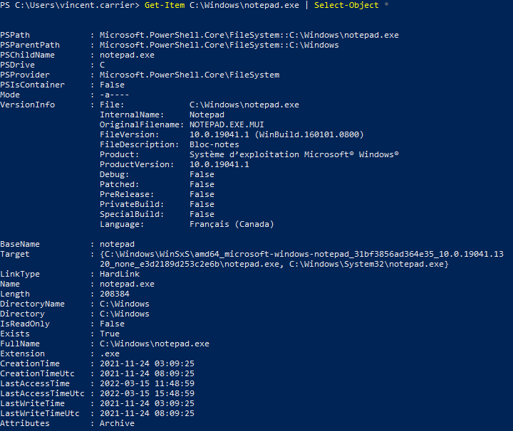

Il est ainsi plus facile de trouver des propriétés intéressantes.


### Appeler une méthode

L'appel d'une méthode se fait de la même manière que pour une propriété, sauf que la méthode peut accepter des paramètres. Comme une méthode n'est pas une commande PowerShell, les paramètres n'obéissent pas aux même règles: ils ne sont pas nommés, et doivent être spécifiés en parenthèses.


Si la méthode qu'on appelle n'a pas de paramètre, il faut écrire les parenthèses quand même.

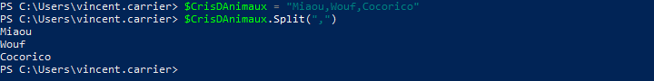


### Connaître le type d'un objet

Une manière de connaître le type d'un objet est d'appeler sa méthode GetType(). Cette méthode existe dans tous les types d'objets, et retourne un objet qui décrit le type de cet objet.


Par exemple, la commande Get-Item peut retourner des fichiers et des dossiers, qui sont des structures très différentes. Selon l'élément que l'on tente d'obtenir, le type de l'objet résultant sera différent.


Si la commande retourne plusieurs objets, alors le type de l'objet retourné sera un array, c'est-à-dire un objet qui contient plusieurs objets. On les identifie avec des crochets [ ] à la fin de leur type.

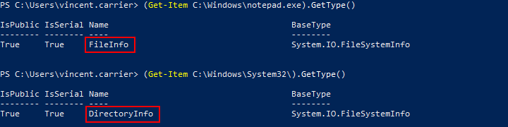


## Le _pipeline_

Le _pipeline_ est le mécanisme par lequel l'information circule dans une session PowerShell. Il permet de chaîner des commandes afin que l'objet sortant d'une commande entre dans la prochaine pour y être traité. Le caractère pour chaîner les commande est la barre verticale `|` (appelée "_pipe_" ou "_tube_").

Pour mieux conceptualiser le _pipeline_, on peut voir chaque commande comme une machine qui prend un ou plusieurs objets en entrée (_input_), effectue un traitement en tenant compte de ces intrants (qui peuvent impliquer des appels au système d'exploitation), puis produit un objet en sortie (_output_) et le jette dans le _pipeline_.


Une commande produisant un objet en sortie (ou un objet déposé directement dans le _pipeline_) sera donc passé en entrée à la commande suivante, qui le passera dans un de ses paramètres, le traitera et produira un autre objet de type différent, qui pourra être passé à la prochaine commande, et ainsi de suite.

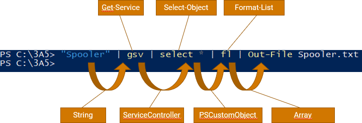

À la fin du _pipeline_, l'objet qui s'y trouve "tombe" dans la console (le host), où il sera automatiquement converti en texte selon plusieurs règles régies à la fois par la configuration de PowerShell et par la nature de cet objet.


On peut éviter à l'objet de tomber dans la console en le "pipant" dans une autre commande (habituellement, avec le verbe Out-), ou bien en l'affectant à une variable.


Si on souhaite se débarrasser de l'objet résultant, il suffit de terminer la chaîne de _pipeline_ par la commande Out-Null, qui désigne simplement une sortie vers rien du tout.


### Sélection

Plusieurs commandes, et particulièrement celles dont le verbe est `Get`, produisent des objets en sortie dans le pipeline, qui possèdent des propriétés. Certains objets en possèdent un grand nombre, et lorsqu'ils sont affichés sous forme de texte dans la console, parfois seules les propriétés principales sont affichées. Une opération simple consiste à "extraire" de cet objet certaines propriétés. Cette opération se nomme la "sélection" et peut être réalisée avec la commande `Select-Object`. 

La sélection ne "transforme" pas vraiment l'objet, elle en produit plutôt une copie transformée.

On peut créer des objets composés de certaines propriétés en spécifiant le paramètre `-Property` de la commande `Select-Object`.

Par exemple, la commande suivante permet de "transformer" l'objet représentant le service "winmgmt" en objet composé uniquement de ses propriétés `Name`et `Status`.

```powershell
Get-Service -Name "winmgmt" | Select-Object -Property "Name", "Status"
```

On remarque qu'à l'exécution de cette commande, il reste des entêtes de colonnes. Alternativement, on peut extraire seulement la **valeur** de la propriété en spécifiant le paramètre `-ExpandProperty`.

```powershell
Get-Service -Name "winmgmt" | Select-Object -ExpandProperty "Status"
```


### Commandes de formatage

Lorsqu'un objet arrive au bout du _pipeline_, il est automatiquement converti en texte par PowerShell afin d'être affiché dans la console dans un format lisible par l'utilisateur. Comme un objet possède des données brutes, PowerShell doit faire un choix dans sa manière de représenter textuellement l'objet à l'écran. Le formatage se fait en fonction de plusieurs facteurs, dont la nature de la commande, le nombre de propriétés de l'objet, etc. On peut utiliser des commandes de formatage (typiquement, des commandes débutant par le verbe `Format-`.)

| Commande | Alias | Description |
| -- | -- | -- |
| `Format-List` | `fl` | Convertit l'objet en texte sous forme de liste |
| `Format-Table` | `ft` | Convertit l’objet en texte sous forme de tableau (moins détaillé) |
| `Format-Wide` | `fw` | Convertit l’objet en texte réparti sur la largeur (très sommaire) |
| `Format-Hex` | `fhx` | Convertit des données en texte montrant leur valeur hexadécimale |

On peut également effectuer des sélections à l'intérieur même de la commande de formatage. 


C'est pratique pour explorer toutes les propriétés d'un objet. On peut le formater sous forme de liste et forcer l'affichage de toutes ses propriétés avec le symbole *.


:::warn

Une fois un objet passé dans la commande de formatage, il est automatiquement converti en texte. C'est pourquoi le formatage est généralement utilisé à la toute fin du pipeline, ou avant une commande de sortie (`Out-`).

:::

### Commandes de sortie

Par défaut, lorsqu'un objet arrive au bout du _pipeline_, il est affiché dans la console (_host_) après avoir été converti en texte. On peut rediriger l'objet vers une autre sortie, comme un fichier ou une imprimante. Voici quelques commandes de sortie disponibles:

| Commande | Alias | Description |
| -- | -- | -- |
| `Out-Default` |  | Envoie l’objet vers la sortie par défaut (implicite, par défaut Out-Host) |
| `Out-Host` | `oh` | Envoie l’objet vers la console (il sera converti automatiquement en texte) |
| `Out-File` |  | Envoie l’objet vers un fichier (il sera converti automatiquement en texte) |
| `Out-Null` |  | Envoie l’objet vers le néant (l’objet sera détruit) |
| `Out-String` | `oss` | Convertit les objets en chaîne de caractères |
| `Out-Printer` | `lp` | Envoie l’objet vers une imprimante |
| `Out-GridView` | `ogv` | Sort l’objet vers une grille graphique (dans une fenêtre séparée) |


### Paramètre PassThru

Ce ne sont pas toutes les commandes qui produisent un objet sur le pipeline. Certaines commandes n'en produisent pas, soit parce qu'elles n'ont pas à le faire, soit parce que la plupart du temps, on n'a pas besoin de cet objet.

Par exemple, la commande `Start-Process` sert à démarrer un processus (un exécutable). Par défaut, lorsqu'on lance cette commande, elle se contente de demander à Windows de créer un processus et ne retourne rien. 


Mais il peut arriver qu'on souhaite enregistrer des informations sur le processus nouvellement créé. Certaines commandes offrent un paramètre `-PassThru`, qui permettent de forcer la production d'un objet décrivant le résultat de la commande. Dans ce cas, la commande `Start-Process` produit un objet décrivant le processus.

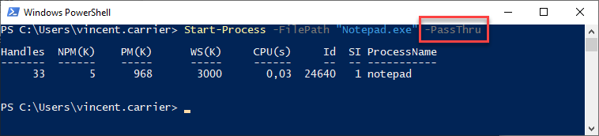


### Commande Tee-Object

La commande `Tee-Object` sert à enregistrer un objet dans une variable ou un fichier, en le relayant en même temps sur le pipeline.

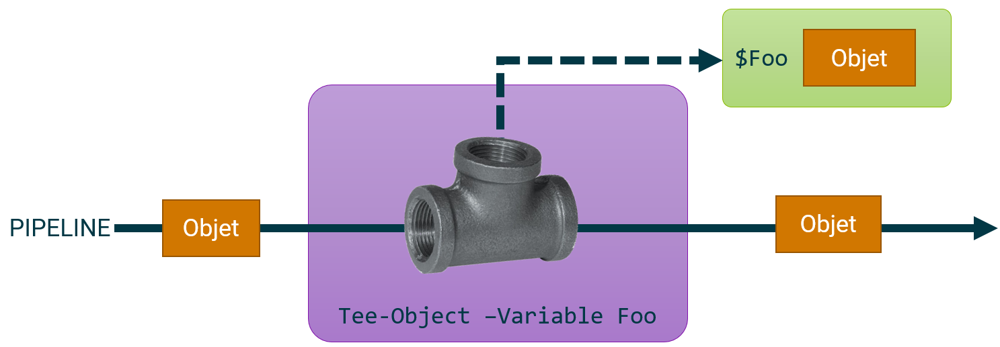

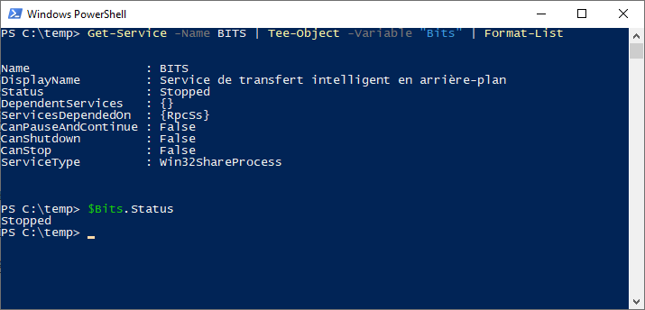

## Les variables

Les variables en PowerShell sont identifiées avec le préfixe `$`. Par exemple, la variable _Foo_ s'écrit `$Foo` dans le code PowerShell. Le nom de la variable est _Foo_, et le caractère `$` indique à PowerShell qu'il s'agit d'une variable.

Une variable contient un objet. L'opération consistant à mettre un objet dans une variable se nomme une affectation, et on la réalise à l'aide de l'opérateur d'affectation, `=`. Cet opérateur récupère l'objet résultant à la fin du _pipeline_ afin de le stocker dans la variable, plutôt que de le laisser tomber dans la console.

Pour obtenir le contenu d'une variable, on utilise simplement son nom avec le caractère `$`. Cela a pour effet d'envoyer son contenu dans le _pipeline_. On peut aussi utiliser cette variable pour passer un objet dans un paramètre.

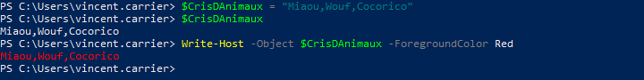

Une variable contient un objet, donc on peut l'utiliser pour accéder à toutes les méthodes et tous les attributs offerts par cet objet.

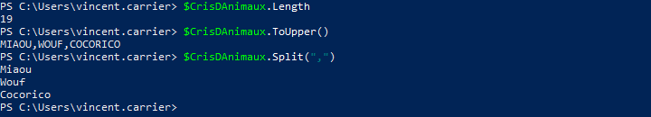

On peut connaître la liste de toutes les variables déclarées avec la commande `Get-Variable`.


### Variables prédéfinies

Certaines variables sont prédéfinies par PowerShell.

| Variable | Description |
| -- | -- |
| `$true` | Représente la valeur booléenne vraie |
| `$false` | Représente la valeur booléenne fausse |
| `$null` | Représente la valeur nulle |
| `$PID` | Le numéro d'identification du processus courant |
| `$PWD` | Représente le répertoire courant |
| `$args` | Contient un tableau des arguments passés à l'appel d'une fonction ou d'un script |
| `$error` | Liste des erreurs lors de la session |
| `$PSVersionTable` | Tableau des versions de PowerShell |
| `$Host` | Objet qui permet de modifier l'interface PowerShell |
| `$Home` | Le chemin du répertoire de l'utilisateur (typiquement `C:\Users\nomdutilisateur`) |
| `$PSHome` | Le chemin dans lequel PowerShell est installé |
| `$PSCulture` | La culture de la session PowerShell (`fr-CA`, `en-US`, etc.) |
| `$_` ou `$PSItem` | Valeur courante dans le _pipeline_ |
| ... | |

### Variables d'environnement

Le système d'exploitation offre à tous les processus un ensemble de variables gérées par le système et qui procurent de l'information sur l'environnement d'exécution. 

Voici quelques variables d'environnement (mais il y en a plusieurs autres).

| Variable (PoSH) | Description |
| -- | -- |
| `$env:COMPUTERNAME` | Le nom d'hôte de l'ordinateur |
| `$env:USERNAME` | Le nom de l'utilisateur |
| `$env:USERDOMAIN` | Le nom du domaine de l'utilisateur courant (format NetBIOS) |
| `$env:USERDNSDOMAIN` | Le nom du domaine de l'utilisateur courant (format FQDN) |
| `$env:LOGONSERVER` | Le nom du contrôleur de domaine ayant authentifié l'utilisateur lors de son logon |
| `$env:UserProfile` | Le chemin vers le profil de l'utilisateur (typiquement C:\Users\nomdutilisateur) |
| `$env:APPDATA` | Chemin vers le répertoire AppData/Roaming de l'utilisateur courant |
| `$env:LocalAppData` | Chemin vers le répertoire AppData/Local de l'utilisateur courant |
| `$env:HOMEDRIVE` | Le lecteur sur lequel est situé le profil de l'utilisateur |
| `$env:HOMEPATH` | Le chemin relatif du profil utilisateur sur le lecteur HOMEDRIVE |
| `$env:TEMP` | Le chemin vers le répertoire temporaire de l'utilisateur (même que TMP) |
| `$env:TMP` | Le chemin vers le répertoire temporaire de l'utilisateur (même que TEMP) |
| `$env:ALLUSERSPROFILE` | Le chemin vers le profil utilisateur commun à tous les utilisateurs (programdata) |
| `$env:ProgramData` | Le chemin du répertoire qui contiennent les configurations du système |
| `$env:ProgramFiles` | Le chemin vers le répertoire contenant les fichiers de programme |
| `$env:{ProgramFiles (x86)}` | Le chemin vers le répertoire des fichiers de programme 32-bits (WoW64) |
| `$env:Path` | La liste des chemins qui contiennent des commandes exécutables |
| `$env:PATHEXT` | La liste des extensions à considérer comme exécutables |
| `$env:PUBLIC` | Le chemin vers le répertoire public (partagé par tous les profils) |
| `$env:NUMBER_OF_PROCESSORS` | Le nombre de processeurs logiques installés dans le système |
| `$env:PROCESSOR_ARCHITECTURE` | L'architecture du processeur (x86, amd64, ia64, arm64, etc.) |
| `$env:ComSpec` | Le chemin vers l'interpréteur de commande par défaut |
| `$env:OneDrive` | Le chemin vers le répertoire de synchronisation de OneDrive |
| `$env:OneDriveCommercial` | Le chemin vers le répertoire de synchronisation de OneDrive For Business |
| `$env:SystemDrive` | Le lecteur sur lequel Windows est installé (typiquement C:) |
| `$env:SystemRoot` | Le chemin vers le répertoire où Windows est installé (typiquement C:\Windows) |
| `$env:PSModulePath` | La liste des chemins qui contiennent des modules PowerShell |

Dans l'interpréteur de commande classique (cmd), et à plusieurs autres endroits du système (comme dans le shell graphique, le registre, etc.), les variables d'environnement sont accessibles en les entourant de deux symboles `%`.


La commande Set permet d'obtenir la liste des variables d'environnement.

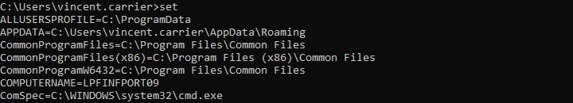

Sous PowerShell, la syntaxe est différente. On utilise le préfixe `$env:` pour y accéder.

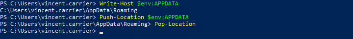

Pour obtenir la liste, on fait un `Get-ChildItem` sur le lecteur `env:`, qui contient toutes les variables d'environnement du processus.

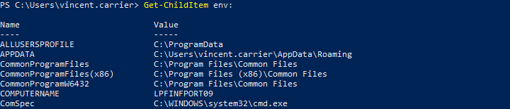

:::caution

Les variables d'environnement sont rattachées à un processus particulier, et chaque processus créé hérite des variables d'environnement du processus parent. Ainsi, si on fait des modification à une variable d'environnement, celle-ci ne sera modifiée que dans ce processus et pas les autres. De plus, le changement sera détruit après la fin du processus, lorsque la fenêtre PowerShell est fermée. Il est possible de modifier une variable d'environnement de manière permanente, mais nous verrons cela dans une séance ultérieure.

:::

## Transcription

Il est possible de demander à PowerShell d'enregistrer automatiquement dans un fichier tout ce qui se fait dans la fenêtre. C'est pratique pour garder des traces de ce qu'on fait. La commande pour tirer profit de cette fonctionnalité est `Start-Transcript`. On fournit à la commande le chemin vers un fichier, et tout ce qui est écrit et affiché dans la console y est sauvegardé. Pour terminer l'enregistrement, il suffit de lancer `Stop-Transcript`, ou simplement de mettre fin à la session PowerShell.


## Types de données

Tout objet en PowerShell possède un type, et s'il est dans une variable, celle-ci possède également ce type. Il existe plusieurs types distincts.

### Nombres entiers

| Type | Description | Valeur minimale | Valeur maximale |
| -- | -- | -- | -- |
| `[byte]` | Entier non signé de 8 bits | 0 | 255 | 
| `[sbyte]` | Entier signé de 8 bits | -128 | 127 |
| `[int16]` | Entier signé de 16 bits | -32 768 | 32 767 |
| `[uint16]` | Entier non signé de 16 bits | 0 | 65 535 |
| `[int32]` _ou_ `[int]` |Entier signé de 32 bits | -2 147 483 648 | 2 147 483 647 |
| `[uint32]` | Entier non signé de 32 bits | 0 | 4 294 967 295 |
| `[int64]` _ou_ `[long]` | Entier signé de 64 bits | -9 223 372 036 854 775 808 | 9 223 372 036 854 775 807 |
| `[uint64]` | Entier non signé de 64 bits | 0 | 18 446 744 073 709 551 615 |

:::info
Par défaut, les nombres entiers sont de type `[int32]` (ou `[int64]` s'il sont trop grands). Pour qu'ils soient de type différent, il faut le spécifier devant la valeur. (Par exemple, `[uint32]42`).
:::


### Nombre à virgule flottante (décimaux)

| Type | Description | Précision | Valeur minimale/maximale |
| -- | -- | -- | -- |
| `[single]` _ou_ `[float]` | Nombre à virgule flottante de précision simple | 32 bits | ± 3,402 823 E+38 |
| `[double]` | Nombre à virgule flottante de précision double (par défaut) | 64 bits | ± 1,79 769 313 486 232 E+308 |
| `[decimal]` | Nombre décimal | 128 bits | ± 79 228 162 514 264 337 593 543 950 335 |

:::info
Par défaut, les nombres non entiers sont de type `[double]`. Pour qu'ils soient d'un autre type, il faut le spécifier devant la valeur (par exemple, `[single] 3.14`).

Les nombres à virgule flottante sont la méthode qu'emploient les ordinateurs pour représenter les nombres non entiers. Ils combinent une mantisse et un exposant, comme dans la notation scientifique, ce qui permet de représenter de très grands nombres mais en sacrifiant de la précision. Vous pouvez suivre ce lien pour en apprendre davantage sur la virgule flottante en informatique. 
:::


### Autres types de données

| Type | Description | Example |
| -- | -- | -- |
| `[boolean]` _ou_ `[bool]` | Valeur booléenne (`$true` ou `$false`) | `$true` |
| `[string]` | Chaîne de caractères à taille fixe | `"allo"` |
| `[char]` | Caractère unicode de 16 bits | `[char]"X"` |
| `[datetime]` | Date et heure | `Get-Date` | 
| `[hashtable]` | Table de hachage | `@{a = 1; b = 2; c = 3}` |
| `[pscustomobject]` | Objet dictionnaire | `[pscustomobject]@{a = 1; b = 2; c = 3}` |
| `[object]` | Type qui décrit n'importe quel objet (toutes les classes dérivent de `[object]`) |  |
| `[array]` _ou_ `[type[]]` | Tableau (contient plusieurs objets, dans un ordre précis) | `@(1, 2, 3)` |
| `[scriptblock]` | Bloc de script précompilé | `$script = [scriptblock]{ # une ou plusieurs commandes… }` |
| `[math]` | Expose des fonctions mathématiques | `[math]::Pow(10,2)` |

Pour en savoir plus sur les types de données PowerShell, consultez [cette page](https://learn.microsoft.com/fr-fr/powershell/scripting/lang-spec/chapter-04?view=powershell-5.1).


### Valeurs minimum et maximum

Toute donnée est un objet, et un objet possède un type. Dans le paradigme orienté objet, un type est une classe, et un objet de ce type est une instance de cette classe. Les classes sont en quelque sorte des plans, ou modèles, qui dictent à quoi une donnée doit ressembler. Une classe est représentée entre crochets `[` et `]`. 

La classe elle-même expose des méthodes et des attributs, dits statiques, qui décrivent certains aspects de ce type. Alors qu'on peut accéder aux méthodes et attributs d'un objet (ou instance de classe) avec un point `.` , on accède les méthodes et attributs d'une classe avec un double deux points `::`.

Dans le cas des types numériques, des attributs de la classe correspondant au type nous permettent d'obtenir les valeurs minimum et maximum que ce type supporte.

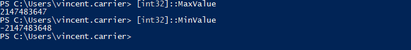


### Conversion de types

On peut convertir les valeurs d'un type à l'autre, et les castant, c’est-à-dire en forçant le type.

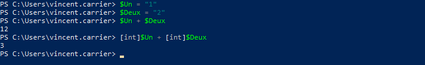

Il faut toutefois faire attention que la valeur soit compatible avec le type vers lequel on souhaite la convertir.

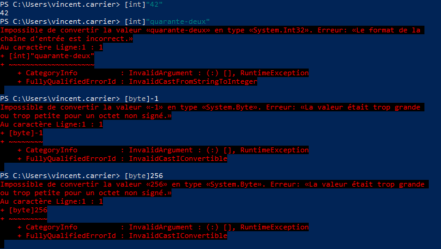


### Suffixes de multiplication des octets

PowerShell nous offre un moyen de calculer facilement les grandeurs (Ko, Mo, Go, etc.)

| Suffixe | Signification | Valeur |
| -- | -- | -- |
| Kb | Kibioctet | 2<sup>10</sup> = 1024 | 
| Mb | Mébioctet | 2<sup>20</sup> = 1024<sup>2</sup> = 1 048 576 | 
| Gb | Gibioctet | 2<sup>30</sup> = 1024<sup>3</sup> = 1 073 741 824 |
| Tb | Tébioctet | 2<sup>40</sup> = 1024<sup>4</sup> = 1 099 511 627 776 |
| Pb | Pébioctet | 2<sup>50</sup> = 1024<sup>5</sup> = 1 125 899 906 842 624 |


Cela peut s'avérer très pratique pour, par exemple, calculer les tailles de fichiers.

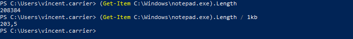


### Chaînes de caractères

Les chaînes de caractères sont un type de données particulièrement commun dans tous les langages de programmation, et PowerShell ne fait pas exception.

#### Guillemets

En PowerShell, les chaînes de caractères sont balisées par des guillemets. Les guillemets simples et doubles sont acceptés.


Un type de guillemet compris dans une chaîne balisée par l'autre type de guillemets sera affiché tel quel.


Par contre, les deux types de guillemets se comportent différemment avec les variables. Le variables écrites dans une chaîne à guillemets doubles sont résolues, alors que celles dans une chaîne à guillemets simples ne le sont pas.


Pour écrire à la fois des guillemets doubles dans une chaîne et résoudre une variable, on peut soit doubler les guillemets doubles (un double-double-guillemet représente le caractère du double-guillemet), ou encore mettre un caractère d'échappement (le backtick) juste avant pour le forcer à être représenté comme caractère dans la chaîne.

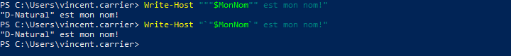

Pour les cas plus complexes, on peut construire une variable temporaire au sein d'une chaîne de caractères, avec la formule $(). C'est pratique si on veut non pas résoudre une variable dans une chaîne, mais plutôt résoudre une expression.


De cette manière, on peut résoudre n'importe quelle expression au sein de la chaîne de caractères.

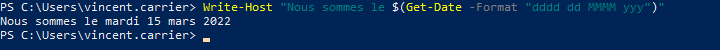

#### Concaténation

On peut aussi concaténer deux chaînes de caractères avec l'opérateur de concaténation `+`.

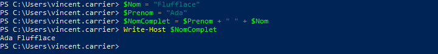

Une autre option pour unir plusieurs éléments d'une chaîne est d'utiliser l'opérateur de formatage `-f`. On écrit la chaîne de caractères mais en y insérant des jetons {n}. Ceux-ci seront remplacés par le contenu des variables spécifiées après l'opérateur `-f`.


Ou encore, on peut toujours insérer les variables directement dans la chaîne, lorsqu'on utilise des guillemets doubles.


### Opérateurs

#### Opérateurs arithmétiques

| Opérateur | Description |
| -- | -- |
| `+` | Addition |
| `-` | Soustraction |
| `*` | Multiplication |
| `/` | Division |
| `%` | Modulo |

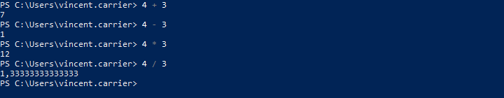

L'opérateur modulo sert à donner le reste de la division entière. En PowerShell, c'est le caractère `%` qui désigne cet opérateur. Pour la division entière par contre, PowerShell n'offre pas d'opérateur, à la différence de plusieurs autres langages. L'opérateur `/` produit une valeur de type `[double]` si le résultat n'est pas un nombre entier, et caster le résultat à `[int]` arrondit ce résultat à l'entier le plus proche. Par conséquent, la composante entière de la division peut être obtenue en appelant la fonction plancher de la classe utilitaire Math.


#### Opérateurs de comparaison

Les opérateurs de comparaison retournent une valeur booléenne vraie ou fausse dans le pipeline, selon un critère précis. On les utilise entre deux valeurs.

| Opérateur | Description | Exemple |
| -- | -- | -- |
| `-eq` | Égal à | `0 -eq 0` |
| `-ne` | Pas égal à | `0 -ne "allo"` |
| `-gt` | Plus grand que | `1 -gt 0` |
| `-ge` | Plus grand ou égal à | `0 -ge 0` |
| `-lt` | Plus petit que | `-1 -lt 0` |
| `-le` | Plus petit ou égal à | `0 -le 0` |
| `-like` | Comparaison avec wildcard | `"allo" -like "a*"` |
| `-notlike` | Inverse de `-like` | `"bonjour" -notlike "a*"` |
| `-match` | Comparaison regex | `"514-555-0123" -match "\d{3}-\d{3}-\d{4}"` |
| `-nomatch` | Inverse de `-match` | `"(514) 555-0123" -match "\d{3}-\d{3}-\d{4}"` |
| `-is` | Comparaison de type | `1.1 -is [double]` |
| `-isnot` | Inverse de `-is` | `1 -isnot [double]` |
| `-and` | Et logique | `(0 -eq 0) -and ("pomme" -eq "pomme")` |
| `-or` | Ou logique | `(0 -eq 0) -or ("pomme" -eq "banane")` |
| `-not` _ou_ `!` | Non logique | `-not (1 -eq 0)` <br/> `!(1 -eq 0)` |
| `-xor` | Ou exclusif | `$true -xor $false` |

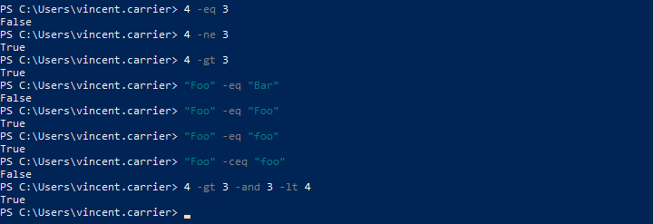


#### Opérateurs d'affectation

Les opérateurs d'affectation modifient l'opérande de gauche.

| Opérateur	Description | Exemple | Équivalent |
| -- | -- | -- |
| `=` | Affectation simple | `$i = 2` |  |
| `+=` | Affectation après addition | `$i += 2` | `$i = $i + 2` |
| `-=` | Affectation après soustraction | `$i -= 2` | `$i = $i - 2` |
| `*=` | Affectation après multiplication | `$i *= 2` | `$i = $i * 2` |
| `/=` | Affectation après division | `$i /= 2` | `$i = $i / 2` |
| `%=` | Affectation après modulo | `$i %= 2` | `$i = $i % 2` |
| `++` | Incrémentation | `$i++` | `$i = $i + 1` |
| `--` | Décrémentation | `$i--` | `$i = $i - 1` |


## Collections et tableaux

Les commandes PowerShell retournent souvent non pas un objet, mais plusieurs objets dans le pipeline. Par exemple, il est fréquent que la commande `Get-ChildItem` retourne plus d'un objet, car il y a généralement plusieurs fichiers et dossiers dans un dossier.


### Compter les objets d'une collection

On peut connaître le nombre d'éléments retournés par une commande à l'aide de la commande `Measure-Object`.


Et comme plusieurs objets mis ensemble constituent une collection d'objets, et que cette collection est également un objet, on peut aussi lire l'attribut `.Length` de cette collection.


### Accéder à un élément précis

Une collection dans PowerShell est une liste d'objet, qu'on appelle aussi Tableau ou Array, et qui est composé de plusieurs valeurs dans un ordre précis. Chaque élément occupe une position: le premier a la position 0, le deuxième 1, et ainsi de suite. Ces nombre s'appelle un indice (index). On peut obtenir l'élément correspondant en spécifiant l'indice voulu entre crochets.


### Créer un tableau

Un tableau vide est créé avec la formule `@()`. Pour initialiser un nouveau tableau, donc, il suffit d'affecter le tableau vide à une variable. On peut ensuit lui ajouter des éléments, avec un opérateur d'affectation.

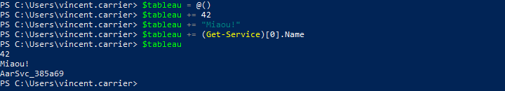

Un tableau peut comprendre plusieurs éléments de types différents, mais habituellement, on il est plus logique d'y retrouver des éléments du même type.

On peut affecter directement des valeurs à la création d'un tableau. Dans ce cas, on n'est pas obligé de respecter la syntaxe `@(…)`; elle est implicite. 


On peut aussi utiliser un raccourci pour créer rapidement un tableau d'entiers.


### Sélectionner des éléments

Lorsqu'on a un tableau d'objet qui circule dans le pipeline, on peut vouloir manipuler ce tableau pour en ressortir certains éléments et pas d'autres.

#### Sélection des indices


#### Sélection conditionnelle

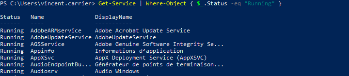

Ou…

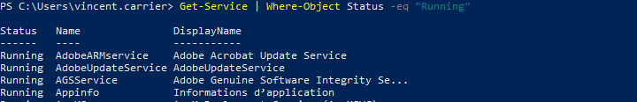


### Opérations sur un tableau

#### Opérateur -Contains

Pour tester si un tableau contient une valeur spécifique, on peut utiliser l'opérateur `-Contains`.


#### Concaténation

Donne tous les objets des deux collections (fusionne deux collections bout à bout)


#### Union

Donne tous les objets de deux collections, mais sans doublons.

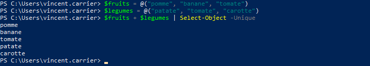

#### Intersection

Donne tous les objets qui ont à la fois dans deux collections

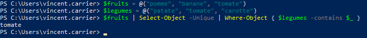

#### Différence

Retourne une collection moins tous les éléments semblables d'une deuxième collection

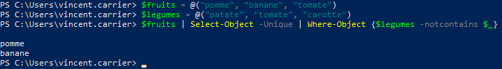

#### Tri

On peut trier une collection à l'aide de la commande `Sort-Object`, par ordre croissant ou décroissant.

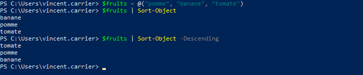

Par défaut, le tri s'effectue sur le nom d'affichage, mais il est possible de spécifier sur quelle propriété devra s'effectuer le tri.


