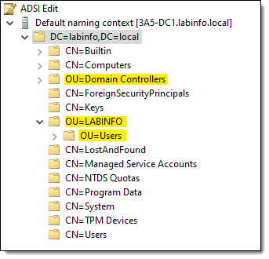
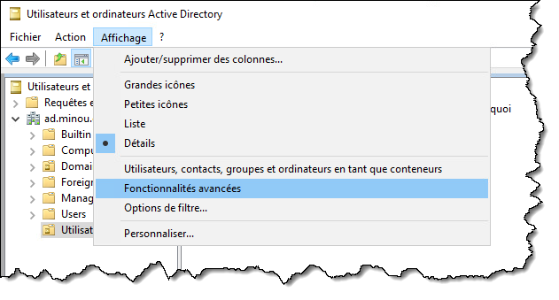
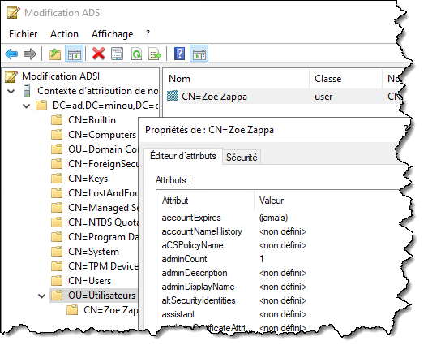
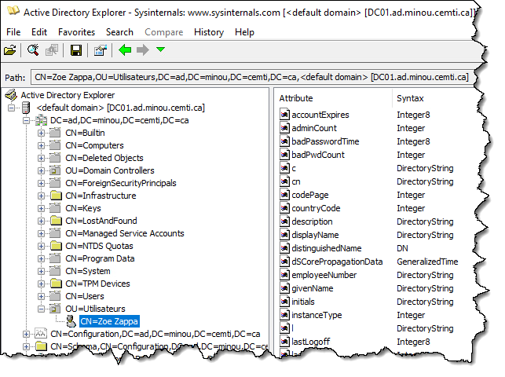
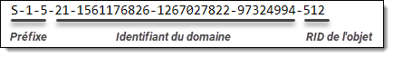

import Tabs from '@theme/Tabs';
import TabItem from '@theme/TabItem';

# Rencontre 5 - Gestion des comptes

:::note Résumé de la séance

<Tabs>

<TabItem value="deroulement" label="👨‍🏫 Déroulement du cours">

1. Rappel du cours précédent
1. Gestion des comptes locaux
1. Gestion des comptes de domaine
1. Git
1. Présentation du TP1

</TabItem>

<TabItem value="exercices" label="💻 Exercices à compléter">

- Travail pratique 1

</TabItem>

<TabItem value="ressources" label="📚 Ressources à consulter">

La présentation PowerPoint est sur le Teams du cours, sous le canal Général > Fichiers > Supports de cours.

</TabItem>

</Tabs>

:::


## Gestion des comptes locaux

À l'exception des contrôleurs de domaine, toutes les machines Windows, qu'elles soient d'une édition client (Windows 10 / 11) ou serveur, possèdent des utilisateurs locaux. Comme vous l'avez vu dans le cours de systèmes d'exploitation, les utilisateurs locaux peuvent être gérés au moyen du composant enfichable "Utilisateurs et groupes locaux" dans une console MMC (accessible par lusrmgr.msc ou compmgmt.msc). Par défaut, lorsqu'on installe Windows, un certain nombre de comptes utilisateurs sont créés, dont *Administrateur* et *Invité*.


Windows possède également un ensemble de groupes locaux prédéfinis. On peut ajouter des comptes (locaux ou domaine) dans un groupe local. Certains groupes possèdent des privilèges particuliers, comme le groupe **Administrateurs**; tous les comptes utilisateurs membres de ce groupe disposent du **privilège d'élévation** ("exécuter en tant qu'admin"). Les membres du groupe **Utilisateurs**, quant à eux, disposent du privilège de **démarrage de session locale**. 

:::caution
Un utilisateur qui n'est pas membre d'un de ces groupes ne sera pas autorisé à démarrer une session.
:::

On peut utiliser PowerShell pour contrôler les utilisateurs locaux, les groupes locaux ainsi que l'appartenance aux groupes locaux. PowerShell offre pour ce faire un module `Microsoft.PowerShell.LocalAccounts` qui renferme plusieurs commandes, notamment:

- `Add-LocalGroupMember`
- `Disable-LocalUser`
- `Enable-LocalUser`
- `Get-LocalGroup`
- `Get-LocalGroupMember`
- `Get-LocalUser`
- `New-LocalGroup`
- `New-LocalUser`
- `Remove-LocalGroup`
- `Remove-LocalGroupMember`
- `Remove-LocalUser`
- `Rename-LocalGroup`
- `Rename-LocalUser`
- `Set-LocalGroup`
- `Set-LocalUser`


### Consulter les utilisateurs existants

La commande Get-LocalUser permet d'obtenir la liste des utilisateurs locaux. Elle retourne un ou plusieurs objets de types `[Microsoft.PowerShell.Commands.LocalUser]` qui décrivent un compte utilisateur local.

<PowerShellWindow workdir="C:\" command="Get-LocalUser" result="
Name               Enabled Description 
----               ------- -----------
Administrateur     True    Compte d’utilisateur d’administration
DefaultAccount     False   Compte utilisateur géré par le système.
Invité             False   Compte d’utilisateur invité
paul               True    Boss de la compagnie
WDAGUtilityAccount False   Compte d’utilisateur géré et utilisé par le syst..."/>

Ces objets possèdent plusieurs informations sur le compte utilisateur. On peut les voir en explorant la structure de l'objet, par exemple avec `Select-Object *`.

<PowerShellWindow workdir="C:\" command="Get-LocalUser -Name 'paul' | Select-Object *" result="
AccountExpires         : 2023-05-12 20:06:27
Description            : Boss de la compagnie
Enabled                : True
FullName               : Paul Meilleur
PasswordChangeableDate : 2023-04-13 20:06:27
PasswordExpires        : 2023-05-24 20:06:27
UserMayChangePassword  : True
PasswordRequired       : False
PasswordLastSet        : 2023-04-12 20:06:27
LastLogon              :
Name                   : paul
SID                    : S-1-5-21-3297567932-2200011671-69726474-1001
PrincipalSource        : Local
ObjectClass            : Utilisateur"/>


### Création d'un nouvel utilisateur

La commande `New-LocalUser` crée un utilisateur local et retourne l'objet décrivant cet utilisateur dans le pipeline (comme il est d'usage par la majorité des commandes exploitant le verbe `New-`). Il faut évidemment que la session PowerShell soit élevée en tant qu'admin pour apporter des modifications sur les utilisateurs locaux.

La commande offre un certains nombres de paramètres pour spécifier les différentes propriétés du compte à créer.

| Paramètre | Type | Description |
| -- | -- | -- |
| `Name` | String | Le nom d'utilisateur (*login*) |
| `FullName` | String | Le nom complet (prénom nom) |
| `Description` | String | Le champ Description |
| `AccountExpires` | DateTime | La date d'expiration de l'utilisateur |
| `AccountNeverExpires` | Switch | Indique que le compte n'expire jamais |
| `Disabled` | Switch | Indique que le compte est désactivé dès sa création |
| `Password` | SecureString | Le mot de passe de l'utilisateur |
| `NoPassword` | Switch | Indique que le compte n'a aucun mot de passe (pas très sécuritaire!) |
| `PasswordNeverExpires` | Switch | Indique que le mot de passe n'expire jamais |
| `UserMayNotChangePassword` | Switch | Indique que l'utilisateur n'a pas le droit de modifier son mot de passe |
| `WhatIf` | Switch | Fait en sorte que la commande ne crée pas l'utilisateur pour vrai (utile pour tester) |

:::info
Le mot de passe est de type `[SecureString]` et pas une chaîne de caractères normale. Ce qui fait qu'on doit d'abord convertir la chaîne de caractère en chaîne sécurisée. On peut le faire au moyen de la commande `ConvertTo-SecureString`.

```powershell
$securepasswd = 'Passw0rd' | ConvertTo-SecureString -AsPlainText -Force
```
:::

Voici un exemple de création d'un compte utilisateur local (en utilisant le *splatting*):

```powershell
$NouvelUtilisateurSplat = @{
    Name = "paul"
    FullName = "Paul Meilleur"
    Description = "Boss de la compagnie"
    AccountExpires = (Get-Date).AddDays(30)   # Dans 30 jours
    Password = ConvertTo-SecureString -String "Passw0rd" -AsPlainText -Force
}

New-LocalUser @NouvelUtilisateurSplat
```

:::danger
On ne devrait jamais mettre des mots de passe en clair dans un script, ni stocker un mot de passe dans une variable en texte clair!!! Voici quelques options pour l'éviter:

- Créer un algorithme qui choisit automatiquement un mot de passe en fonction d'information provenant de l'extérieur
- Utiliser la commande `Read-Host -AsSecureString` pour demander à l'utilisateur d'entrer un mot de passe (dont la saisie est masquée
- Utiliser `Get-Credential` pour fournir un nom d'utilisateur et un mot de passe. Nous verrons plus loin cette commande lorsque nous traiterons de l'authentification par PowerShell.
:::

### Groupes locaux

À l'instar des utilisateurs, on peut connaître les groupes locaux au moyen de la commande `Get-LocalGroup`.

Pour créer un groupe local, on utilise la commande `New-LocalGroup`. Là encore, cette commande ne fonctionne que dans une session PowerShell élevée.

Pour obtenir les membres d'un groupe, on peut utiliser la commande `Get-LocalGroupMember`.

<PowerShellWindow workdir="C:\" command="Get-LocalGroupMember -Group 'Administrateurs'" result="
ObjectClass Name                    PrincipalSource
----------- ----                    ---------------
Utilisateur PC0001\Administrateur   Local
Utilisateur PC0001\bob              Local
Utilisateur PC0001\paul             Local
Utilisateur PC0001\pierre           Local
Groupe      MINOU\Admins du domaine ActiveDirectory
Utilisateur MINOU\paul.meilleur     ActiveDirectory"/>

Pour ajouter un utilisateur dans un groupe, on utilise la commande `Add-LocalGroupMember`. Cette commande prend en paramètre `-Member` qui désigne le membre à ajouter, ainsi que `-Group` qui désigne le groupe dans lequel l'ajouter.

```powershell
Add-LocalGroupMember –Member "Paul" -Group "Administrateurs"
```

Cette commande admet qu'on passe le membre à ajouter par le pipeline en entrée.

```powershell
Get-LocalUser -Name "Paul" | Add-LocalGroupMember -Group "Administrateurs"
```

Cela permet, entre autres, de créer un compte et l'ajouter immédiatement à un groupe, puisque la création génère un objet représentant l'utilisateur.

```powershell
New-LocalUser -Name "Zoe" -NoPassword | Add-LocalGroupMember -Group "Utilisateurs"
```

:::info
On peut aussi ajouter des utilisateurs ou des groupes du domaine comme membre d'un groupe local. Pour ce faire, on n'a qu'à spécifier le sAMAccountName du principal de sécurité du domaine. Si la machine dispose d'une relation d'approbation avec le domaine du compte, celui-ci sera ajouté comme membre au groupe.

```powershell
Add-LocalGroupMember –Member "DOMAINE\paul.meilleur" -Group "Administrateurs"
```
:::


:::tip
Le nom des groupes est différent sur les versions anglaise et française de Windows. Pour que le script fonctionne indépendamment de la langue du système, on peut utiliser le SID du groupe plutôt que son nom. Le SID est un numéro d'identification unique, et dans le cas des groupes prédéfinis dans Windows (Administrateurs, Utilisateurs), il est toujours le même peu importe la langue.

On peut voir les SID des groupes avec la commande suivante:

```powershell
Get-LocalGroup | Select-Object -Property Name, SID
```

Voici quelques SID bien connus:

| Nom français | Nom anglais | SID |
| -- | -- | -- |
| Administrateurs | Administrators | `S-1-5-32-544` |
| Utilisateurs | Users | `S-1-5-32 545` |

Par exemple, pour ajouter un utilisateur au groupe des administrateurs:

```powershell
$MonUtilisateur | Add-LocalGroupMember -SID "S-1-5-32-544"
```
:::


## Gestion des comptes du domaine

### Outils RSAT

Lorsqu'on fait la promotion d'un serveur Windows en contrôleur de domaine, les outils d'administration d'Active Directory s'installent automatiquement sur cette machine. Les outils d'administration AD font partie d'une collection de consoles MMC connue sous le nom de RSAT (Remote Server Administration Tools).

Il existe plusieurs outils RSAT, qui sont normalement activés lorsqu'on installe le rôle ou la fonctionnalité sur un serveur, afin d'être utilisés localement sur ce serveur. Ce sont des composants optionnels de Windows, qui sont prêts à être installés lorsque nécessaire. Ainsi, la console RSAT DNS est installée automatiquement sur un serveur lorsqu'on active le rôle DNS, et la console DHCP s'installe automatiquement sur un serveur DHCP, etc. On n'est pas obligé d'installer toutes les consoles RSAT, seulement celles dont on a besoin.

Lorsqu'on installe un rôle (par exemple, Active Directory Domain Services), les consoles pour AD s'installent automatiquement. Mais il arrive qu'on souhaite installer une console RSAT sur une machine pour l'administration à distance. On peut donc installer les consoles indépendamment, ce qui nous permet d'utiliser ce serveur pour administrer un service hébergé sur un autre serveur.

Par exemple, il est rare que les administrateurs AD démarrent une session interactive RDP ou locale sur un contrôleur de domaine pour y créer des utilisateurs. Ce n'est pas une bonne pratique. Généralement, les administrateurs vont opérer la console sur une autre machine, soit leur poste de travail ou sur un serveur tiers qu'on qualifie de "jump station".

Les consoles qui font partie des outils RSAT pour Active Directory sont:

- Active Directory Users and Computers (dsa.msc)
- Active Directory Sites and Services (dssite.msc)
- Active Directory Domains and Trusts (domain.msc)
- ADSIEdit (adsiedit.msc)
- Active Directory Administrative Center (dsac.exe)
- Group Policy Managament Tool (gpmc.msc)

Lorsqu'on installe les outils RSAT pour Active Directory, un module PowerShell pour manipuler Active Directory s'installe également. On peut utiliser ce module pour accéder à des commandes PowerShell utilisable dans nos scripts pour automatiser ce que nous ferions normalement à la main via les consoles MMC. Les outils RSAT installés sont exposés via l'élément Administrative Tools du menu Démarrer ou du vieux panneau de configuration de Windows (control.exe).

Les procédures et les commandes pour installer les outils RSAT ne sont pas les mêmes pour les éditions client et serveur de Windows.

#### Installer RSAT sous Windows Server

Sur un serveur Windows, par défaut, lorsqu'on installe un rôle ou une fonctionnalité, les outils RSAT correspondants s'installent aussi. Pour installer un outil RSAT sans installer le rôle ou la fonctionnalité, on peut utiliser les commandes dont le nom est *WindowsFeature*.

La commande `Get-WindowsFeature` permet d'obtenir la liste des rôles et fonctionnalités (dans la même liste, contrairement à l'interface graphique). Chaque fonctionnalité a son nom qui respecte une convention de nommage, et toutes les consoles d'administrations commencent par le préfixe RSAT (à l'exception de la console de gestion des stratégies de groupe).

Pour voir tous les outils d'administration disponibles, on peut lancer:

```powershell
Get-WindowsFeature -Name "RSAT-*", "GPMC"
```

Pour installer toutes les consoles de gestion pour Active Directory DS, y compris la console de gestion des stratégies de groupe (GPMC) et le module PowerShell, lancez la commande suivante:

```powershell
Install-WindowsFeature -Name RSAT-AD-Tools, GPMC -IncludeAllSubFeature
```

#### Installer RSAT sous Windows 10/11

Sur un client Windows, les outils RSAT sont considérés comme des composants optionnels, aussi appelés "Feature-on-Demand", qui peuvent être installés à la demande. Contrairement aux serveurs, les éditions clientes de Windows doivent télécharger les composants RSAT d'Internet sur les serveurs de mises à jour de Microsoft.

Pour gérer ces composants optionnels, on peut utiliser les commande PowerShell dont le nom est "WindowsCapability".

Pour installer toutes les consoles de gestion pour Active Directory DS, y compris la console de gestion des stratégies de groupe (GPMC) et le module PowerShell, lancez la commande suivante:

```powershell
Get-WindowsCapability -Online | Where-Object { $_.Name -Match "^rsat\.activedirectory|grouppolicy.*$" } | Add-WindowsCapability -Online
```

#### Module PowerShell pour ADDS

Les outils RSAT pour administrer Active Directory comprennent un module PowerShell qui offre une panoplie de commandes pour contrôler AD.

Pour l'utiliser, il faut importer le module.

```powershell
Import-Module ActiveDirectory
```

:::info
Il n'est pas nécessaire d'exécuter ces commandes à partir d'un contrôleur de domaine. En fait, il est préférable de le faire à partir d'un autre ordinateur, pourvu qu'il soit membre du domaine. C'est le compte utilisé pour lancer les commandes qui importe, pas la machine sur laquelle elles sont lancées.
:::

On peut ensuite lister toutes les commandes qui sont offertes par ce module.

```powershell
Get-Command -Module ActiveDirectory
```

On peut vérifier les modules installés qui sont disponibles pour être importés. Pour vérifier quels modules sont importés dans la session PowerShell en cours, on utilise la commande `Get-Module`.

```powershell
Get-Module -ListAvailable
```

Pour charger le module Active Directory dans un script, on doit lancer la commande `Import-Module` au début du script (plus précisément, avant de lancer toute commande de ce module).

Il est aussi recommandé d'ajouter une instruction `#Requires`, pour faire planter le script automatiquement avant même le début de son exécution si le module Active Directory n'est pas installé. On évite ainsi des erreurs plus tard dans le script.

```powershell
#Requires -Module ActiveDirectory
Import-Module ActiveDirectory
```

Plus de détails sur l'instruction `#Requires` ici: https://docs.microsoft.com/en-us/powershell/module/microsoft.powershell.core/about/about_requires?view=powershell-5.1


### Informations sur le domaine et la forêt

Les commandes `Get-ADDomain` et `Get-ADForest` permettent d'obtenir de l'information sur le domaine et la forêt respectivement, tels que le niveau fonctionnel, les contrôleurs de domaine qui disposent d'un rôle FSMO, les conteneurs par défaut, le SID du domaine, la topologie des sites, etc.

[Get-ADDomain](./assets/r05/get-addomain.png)

Une information intéressante est celle du contexte de nom par défaut (*Default Naming Context*). Il équivaut à la partie domaine à la fin des noms distinctifs des objets dans le domaine. On peut l'obtenir à l'aide de la commande `Get-RootDSE`.

```powershell
(Get-ADRootDSE).defaultNamingContext
```


### Unités d'organisation

Les unités d'organisation (*Organizational Unit*, ou *OU*) sont des conteneurs dans lesquels on peut disposer des objets du domaine et sur lesquels on peut lier des stratégies de groupe (GPO). Ce ne sont pas tous les conteneurs qui sont des unités d'organisation; ces dernières portent le préfixe `OU=` dans leur nom distinctif relatif.




#### Recherche d'une unité d'organisation

Pour obtenir de l'information sur une unité d'organisation spécifique, on peut utiliser la commande `Get-ADOrganizationalUnit` en lui fournissant le nom distinctif (DN) de l'unité d'organisation.

```powershell
Get-ADOrganizationalUnit -Identity "OU=Laptops,DC=ad,DC=mondomaine,DC=com"
```

On peut obtenir la liste de toutes les unités d'organisation du domaine en spécifiant le filtre *

```powershell
Get-ADOrganizationalUnit -Filter * | Format-Table
```

#### Création d'une unité d'organisation

Pour créer une unité d'organisation dans un domaine, on utilise la commande `New-ADOrganizationalUnit` en lui spécifiant le nom de l'OU à créer ainsi que le nom distinctif complet du conteneur parent.

```powershell
$ADOrganizationalUnitSplat = @{
    Name = "Laptops"
    Path = "OU=Laptops,DC=ad,DC=mondomaine,DC=com"
}

New-ADOrganizationalUnit @ADOrganizationalUnitSplat
```

:::info
La commande `New-ADOrganizationalUnit` ne retourne pas d'objet par défaut dans le pipeline. Pour qu'elle en retourne un, on n'a qu'à lui passer le switch `-PassThru`.

```powershell
New-ADOrganizationalUnit @ADOrganizationalUnitSplat -PassThru
```
:::


### Comptes utilisateurs

#### Recherche d'un compte utilisateur 

Pour rechercher un utilisateur dans Active Directory, la commande à utiliser est `Get-ADUser`.

Pour rechercher un utilisateur spécifique, on peut spécifier le paramètre `-Identity`. Ce paramètre peut admettre comme valeur le nom d'utilisateur court (sAMAccountName), le nom distinctif (DN), le SID ou le GUID.

```powershell
Get-ADUser -Identity "zzappa"
```

Pour rechercher les utilisateurs obéissant à certains critères, on peut utiliser le paramètre `-Filter`.

```powershell
Get-ADUser -Filter 'sAMAccountName -like "z*"'
```

#### Vérification de l'existence d'un compte utilisateur

Pour tester l'existence d'un utilisateur dans le domaine, voici un exemple:

```powershell
if (Get-ADUser -Filter 'sAMAccountName -eq "zzappa"') {
    Write-Host "L'utilisateur existe."
}
else {
    Write-Host "L'utilisateur n'existe pas."
}
```


#### Création d'un nouveau compte utilisateur

Pour créer un nouvel utilisateur, on peut utiliser la commande `New-ADUser`. Étant donné la quantité d'attributs disponibles dans les objets utilisateurs, cette commande admet un très grand nombre d'arguments. Voici un exemple de création d'un compte utilisateur (la plupart de ces attributs sont facultatifs; en fait, seul le paramètre `Name` est obligatoire).

```powershell
$ADUserSplat = @{
    Path = "OU=Utilisateurs,DC=ad,DC=mondomaine,DC=com"
    Name = "Zoe Zappa"
    GivenName = "Zoé"
    Surname = "Zappa"
    Initials = "Z."
    Title = "Dr."
    DisplayName = "Dr. Zoé Zappa, Ph.D."
    Description = "VP de chépoquoi"
    SamAccountName = "zzappa"
    UserPrincipalName = "zzappa@ad.mondomaine.com"
    AccountPassword = "Passw0rd" | ConvertTo-SecureString -AsPlainText -Force
    ChangePasswordAtLogon = $true
    StreetAddress = "42 rue des timinous"
    City = "Minoupolis"
    Country = "CA"
    PostalCode = "H0H 0H0"
    MobilePhone = "(555) 555-5555"
    EmployeeNumber = "2546011"
    EmailAddress = "zzappa@mondomaine.com"
    Enabled = $true
}

New-ADUser @ADUserSplat
```

Vous pouvez consulter la liste des paramètres de cette commande sur [sa page de documentation](https://learn.microsoft.com/fr-ca/powershell/module/activedirectory/new-aduser).

#### Modification d'un compte utilisateur existant

On peut utiliser la commande `Set-ADUser` pour modifier un attribut d'un compte utilisateur existant. L'exemple suivant modifie l'adresse courriel de l'utilisateur Bob.

```powershell
$ADSetUserSplat = @{
    Identity = "Bob"
    EmailAddress = "bob@mondomaine.com"
}

Set-ADUser @ADSetUserSplat
```


#### Suppression d'un compte utilisateur

On peut utiliser la commande `Remove-ADUser` pour supprimer un compte utilisateur. Voici un exemple en lui passant un compte utilisateur par le pipeline.

```powershell
Get-ADUser -Identity "zzappa" | Remove-ADUser
```

:::tip
Dans son comportement par défaut, `Remove-ADUser` demande une confirmation. Pour rendre l'opération complètement automatique, on peut désactiver le switch `-Confirm`, qui est activé par défaut (étrangement).

```powershell
Remove-ADUser -Identity "zzappa" -Confirm:$false
```
:::


### Groupes

#### Recherche d'un groupe

Pour obtenir de l'information sur un groupe, on peut utiliser la commande `Get-ADGroup`. Cette commande s'emploie de la même manière que pour les utilisateurs.

```powershell
Get-ADGroup -Identity "Comptables"
```

Le paramètre `-Identity` peut admettre le nom du compte (*sAMAccountName*) mais aussi son *SID*, son *GUID* ou son nom distinctif (*DN*).

```powershell
Get-ADGroup -Identity "CN=Comptables,OU=Groupes,DC=ad,DC=mondomaine,DC=com"
```

#### Vérification de l'existence d'un groupe

Pour vérifier si un groupe existe, on peut employer la même logique que pour les utilisateurs.

```powershell
if (Get-ADGroup -Filter 'sAMAccountName -eq "Comptables"') {
    Write-Host "L'utilisateur existe."
}
else {
    Write-Host "L'utilisateur n'existe pas."
}
```

#### Création d'un nouveau groupe

Pour créer un nouveau groupe, voici un exemple. Il faut minimalement spécifier son nom, sa portée (global, domaine local ou universel) ainsi que le nom distinctif complet du conteneur dans lequel le créer.

```powershell
$ADGroupSplat = @{
    Name = "Gestionnaires"
    GroupScope = "Global"
    Path = "OU=Groupes,DC=ad,DC=mondomaine,DC=com"
}

New-ADGroup @ADGroupSplat
```


### Membres de groupes

Un groupe possède des membres, qui peuvent être soit des utilisateurs, des ordinateurs ou d'autres groupes. On nomme ces objets des *principaux de sécurité*. 

#### Obtention des membres d'un groupe

Pour consulter quels principaux de sécurité sont membres d'un groupe spécifique, voici un exemple:

```powershell
Get-ADGroupMember -Identity "Comptables"
```

On peut aussi passer un groupe par le pipeline.

```powershell
Get-ADGroup -Identity "Comptables" | Get-ADGroupMember
```

#### Ajout de membres à un groupe

Pour ajouter un utilisateur à un groupe, voici un exemple:

```powershell
Add-ADGroupMember -Identity "Admins du domaine" -Members "zzappa"
```

On peut également ajouter un autre type de principal de sécurité, comme un compte ordinateur ou un groupe. Le procédé est alors exactement le même; il suffit de donner le nom du groupe ou de l'ordinateur dans l'argument `-Members`. Par ailleurs, puisque le paramètre `-Members` admet un tableau, il est possible de lui passer un tableaux de membres, qui seront tous ajoutés d'un coup au groupe.


#### Retrait de membres à un groupe

Pour retirer un compte d'un groupe, il suffit d'utiliser cette commande:

```powershell
Remove-ADGroupMember -Identity "Admins du domaine" -Members "zzappa"
```

:::tip
Pour éviter de dépendre de la langue du système et de la traduction de ses noms de groupes, on peut utiliser le SID des groupes bien connus, comme le groupe des admins du domaine.

Le SID du groupe des admins du domaine est constitué du SID du domaine suivi du RID 512. Ainsi, voici comment on peut le trouver dynamiquement.

```powershell
$DomainSID = (Get-ADDomain).DomainSID.Value
$DomainAdminSID = "$DomainSID-512"
Add-ADGroupMember -Identity $DomainAdminSID -Members "zzappa"
```
:::


### Attributs

Lorsqu'on utilise des commandes *Get* comme `Get-ADUser` ou `Get-ADComputer`, ce ne sont pas tous les attributs des objets qui sont interrogés, et ce, même si on le passe dans un `Select-Object *`. Pour interroger un attribut qui ne l'est pas par défaut, il faut le spécifier au moyen du paramètre `-Properties`.

```powershell
Get-ADUser -Identity "zzappa" -Properties *
```

Par exemple, pour obtenir la date de création, on peut ajouter la propriété `Created`, qui n'est pas incluse dans l'objet par défaut.


### Outils supplémentaires

Pour parcourir graphiquement les attributs des objets, on peut utiliser divers outils.


#### Fonctionnalités avancées de la console ADUC

Tout d'abord, la console Utilisateurs et ordinateurs Active Directory (*dsa.msc*) offre un onglet **Éditeur d'attributs**. Il n'est pas visible par défaut; il faut d'abord activer les **fonctionnalités avancées** de la console via le menu **Affichage**.

 


#### ADSI Edit

Il existe également un autre outil provenant des outils RSAT: l'outil de modification ADSI (adsiedit.msc). Il permet de parcourir la base de données LDAP du domaine et permet un meilleur contrôle du domaine, à plus bas niveau. 




#### ADExplorer (Sysinternals)

Finalement, l'outil [ADExplorer](https://learn.microsoft.com/fr-ca/sysinternals/downloads/adexplorer), provenant de la suite [SysInternals](https://learn.microsoft.com/fr-ca/sysinternals) de Microsoft, permet de parcourir le domaine à très bas niveau, tout comme ADSIEdit, mais ne nécessite pas l'installation des outils RSAT. Il permet une navigation plus fluide que ADSIEdit, en montrant l'arborescence LDAP dans le panneau de gauche et les attributs de l'objet sélectionné dans le panneau de droite. Cet outil n'est pas inclus dans Windows, il faut le [télécharger à partir du site Web de Microsoft](https://learn.microsoft.com/fr-ca/sysinternals/downloads/adexplorer).




#### Module AdsiPS

Le module Active Directory de Windows est très pratique mais présente deux inconvénients:
- Il nécessite l'installation des outils RSAT (donc des droits admin locaux et un accès à Microsoft Update)
- Ses commandes n'emploient pas le protocole LDAP standard (port 389/tcp) mais plutôt ADWS (port 9389/tcp)

Mon collègue François-Xavier Cat a développé un module PowerShell qui se veut une alternative au module Active Directory. Il ne nécessite pas d'installation de RSAT et passe par le protocole LDAP.

Voici le lien vers son module: https://github.com/lazywinadmin/AdsiPS 

La manière la plus simple d'installer le module est avec la commande Install-Module

```powershell
Install-Module -Name AdsiPS
```

Si vous ne disposez pas de droits d'administration sur votre machine, vous pouvez alors le faire seulement pour votre profil utilisateur

```powershell
Install-Module -Name AdsiPS -Scope CurrentUser
```

Consultez cette page pour connaître la syntaxe des commandes de ce module: https://github.com/lazywinadmin/AdsiPS/blob/master/docs/doc_functions.md 


## EXTRA: SID, RID et principaux de sécurité

Dans les services de domaine Active Directory, certains objets ont la propriété de pouvoir se faire attribuer des droits à des ressources. Ce sont ces types d'objets qui peuvent, par exemple, être ajoutés à une liste de contrôle d'accès (ACL). Ces objets se nomment les principaux de sécurité. 

Active Directory compte quatre types de principaux de sécurité: les comptes utilisateurs, les comptes d'ordinateurs, les groupes, ainsi que les comptes de service gérés, plus rarement utilisés. Ces objets possèdent un numéro unique de sécurité, le SID, et c'est ce numéro qui est référencé dans les listes de permissions.


### Principaux de sécurité Active Directory

Certains utilisateurs et groupes dans un domaine Active Directory sont créés automatiquement dès la création du domaine. Leur nom peut varier d'un domaine à l'autre, en fonction de la langue du premier contrôleur de domaine ayant été promu. Dans un domaine en anglais, le groupe des admins du domaine se nomme "Domain Admins", alors que dans un domaine en français, il se nomme "Admins du domaine". Même chose pour le compte Administrateur, qui se nomme Administrateur en français, et qu'il est même possible de renommer au moyen d'une GPO. Cela peut compliquer le développement de scripts, qu'on a avantage à rendre le plus général possible.

À titre d'exemple, voici le SID du groupe des admins du domaine sur un domaine donné. Il est composé de l'identifiant du domaine, auquel on greffe un identifiant relatif, le RID, à la fin de celui-ci. Le contrôleur de domaine qui détient le rôle FSMO de RID Master est responsable de la gestion de ces RID, afin de s'assurer qu'ils sont uniques dans tout le domaine.



Les principaux de domaine, quant à eux, sont relatifs au domaine, mais leur RID est toujours le même d'un domaine à l'autre. Le groupe des admins du domaine possède le RID 512, donc leur SID est équivalent au SID du domaine, suivi de "-512". On peut donc obtenir le SID de tout principal de domaine simplement en connaissant son RID ainsi que le SID du domaine, qui peut être obtenu par la commande Get-ADDomain. Les identifiants sont documentés sur le site de Microsoft.

En voici quelques exemples:

| Nom                             | Type             | RID (décimal) | RID (hexadécimal) |
| ------------------------------- | ---------------- | ------------- | ------------------|
| Administrateur                  | Utilisateur      | 500           | 0x000001F4        |
| Admins du domaine               | Groupe global    | 512           | 0x00000200        |
| Utilisateurs du domaine         | Groupe global    | 513           | 0x00000201        |
| Ordinateurs du domaine          | Groupe global    | 515           | 0x00000203        |
| Contrôleurs de domaine          | Groupe global    | 516           | 0x00000204        |
| Administrateurs du schéma       | Groupe universel | 518           | 0x00000206        |
| Administrateurs de l'entreprise | Groupe universel | 519           | 0x00000207        |


Il est préférable d'utiliser le SID d'un de ces principaux, plutôt que son nom, car ainsi, le script peut fonctionner indépendamment de la langue. Il suffit de réunir le SID du domaine et le RID du principal pour obtenir son SID.

```powershell
$DOMAIN_GROUP_RID_ADMINS = 512
$DomainSID = (Get-ADDomain).DomainSid.Value
$DomainAdminSID = "$DomainSID-$DOMAIN_GROUP_RID_ADMINS"
Get-ADGroup -Identity $DomainAdminSID
```

### Groupes de sécurité locaux

Windows dispose de groupes créés automatiquement dès son installation, ainsi que des principaux spéciaux, comme les "utilisateurs authentifiés" ou le groupe "tout le monde". Ces principaux ont toujours le même SID peu importe la machine et peu importe la langue. Les principaux locaux possèdent toujours le même SID. 

| Nom                               | SID          |
| --------------------------------- | ------------ |
| Administrateurs                   | S-1-5-32-544 |
| Utilisateurs                      | S-1-5-32-545 |
| Utilisateurs du bureau à distance | S-1-5-32-555 |
| Invités                           | S-1-5-32-546 |
| Utilisateurs authentifiés         | S-1-5-11     |
| SYSTÈME                           | S-1-5-18     |
| Tout le monde                     | S-1-1-0      |


Référence: [Security identifiers (Windows 10) - Windows security | Microsoft Docs](https://docs.microsoft.com/en-us/windows/security/identity-protection/access-control/security-identifiers)
