import Tabs from '@theme/Tabs';
import TabItem from '@theme/TabItem';

# Rencontre 8 - Registre et streams

:::note Résumé de la séance du vendredi 3 novembre 2023

<Tabs>

<TabItem value="deroulement" label="👨‍🏫 Déroulement du cours">

1. Retour sur l'examen intra
1. Les fournisseurs PowerShell et les PSDrives
1. Le registre de Windows
1. L'accès au registre avec PowerShell
1. Les streams

</TabItem>

<TabItem value="exercices" label="💻 Exercices à compléter">

Exercice 8 sur OneNote

</TabItem>

<TabItem value="ressources" label="📚 Ressources à consulter">

La présentation PowerPoint est sur le Teams du cours, sous le canal Général > Fichiers > Supports de cours.

</TabItem>

</Tabs>

:::

## *PSProvider* et *PSDrive*

Les **fournisseurs PowerShell** (appelés *PSProvider*) sont des couches d'abstraction permettant d'obtenir des données de différentes natures de manière uniforme.

Par exemple, le système de fichiers, les variables d'environnement et le registre sont des systèmes de données très différents. Grâce aux providers, on peut les interroger de la même manière et avec les mêmes commandes.

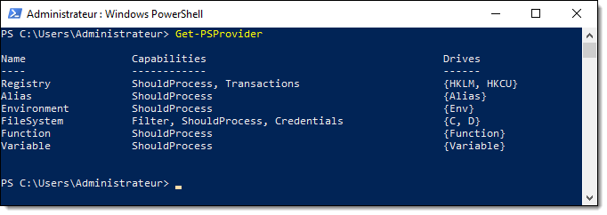


Voici les principaux providers

| Nom         | Description |
| ----------- | ----------- |
| FileSystem  | Ce provider procure un accès au système de fichiers. |
| Registry    | Ce provider permet de manipuler la base de registre. |
| Alias       | Ce provider permet de manipuler les alias PowerShell |
| Variable    | Ce provider permet d'interroger et gérer les variables PowerShell |
| Function    | Ce provider permet d'interroger et gérer les fonctions PowerShell |
| Environment | Ce provider donne accès aux variables d'environnement de la session en cours |


Les **lecteurs PowerShell** (*PSDrive*) sont des points d'entrée vers une ressource gérée par un *PSProvider*. Par exemple, les lecteurs C: et D: sont des lecteurs contenant un système de fichiers, accessible via le fournisseur *FileSystem*.


Plusieurs commandes PowerShell adoptent un comportement différent en fonction du fournisseur duquel le chemin spécifié est issu. 

Dans l'exemple ci-dessous, on peut voir que le type d'élément retourné par `Get-ChildItem` est différent selon que le lecteur spécifié en est un exposé par le fournisseur `FileSystem` ou par le fournisseur `Environment` (qui contient les variables d'environnement).

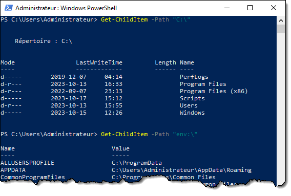


## Le registre de Windows

Le registre de Windows est une base de données interne à Windows qui sert à **centraliser la configuration** du système d'exploitation et de ses applications afin d'éviter l'éparpillement de fichiers de configuration.

Le registre est un composant fondamental du système d'exploitation. Windows offre diverses méthodes permettant aux applications et aux scripts de lire et d'écrire des valeurs dans le registre.

L'éditeur de registre (regedit.exe) est un outil intégré à Windows qui permet d'explorer le registre à l'aide d'une interface graphique, à l'instar de l'explorateur de fichiers permet d'explorer graphiquement le système de fichiers.


### Structure du registre

Le registre de Windows est composé de deux types d'éléments: les **clés** (*keys*) et les **valeurs** (*values*).


### Clés

Les **clés** sont des conteneurs, un peu comme les répertoires dans un système de fichiers. Elles peuvent contenir des valeurs ainsi que d'autres clés (qu'un appellera sous-clés, ou *subkeys*). Les premières clés, situées au premier niveau de l'arborescence, sont appelés des **clés de ruche** (*hive key*) ou des **clés racine** (*root key*) et ont pour préfixe HKEY_ (un diminutif de *hive key*).


### Valeurs

Les **valeurs** sont des éléments porteurs de données utilisables. Ils sont comparables aux fichiers dans un système de fichiers, mais leur contenu tend à être beaucoup plus petit et circonscrit à une propriété ou à une configuration unique. 

Chaque valeur de registre est contenue dans une clé et possède trois attributs: un **nom**, un **type** et une **donnée**.


Les données inscrite dans une clé doivent être d'un type précis. Voici les principaux types de données admissibles pour une valeur de registre:

| Type | Nom | Description |
| -- | -- | -- |
| REG_SZ | String | Une chaîne de caractères |
| REG_MULTI_SZ | MultiString | Un tableau de chaînes de caractères |
| REG_EXPAND_SZ | ExpandString | Une chaîne de caractères avec variables d'environnement (ex. %APPDATA%) |
| REG_DWORD | DWord | Une valeur numérique de 32 bits (équivalent à [uint32]) |
| REG_QWORD | QWord | Une valeur numérique de 64 bits (équivalent à [uint64]) |
| REG_BINARY | Binary | Des données binaires brutes |


### Fichiers du registre

La base de registre est composée de plusieurs fichiers, appelés **ruches** (*hive*). Au démarrage de Windows (ou d'une session utilisateur), Voici les principaux fichiers qui sont chargés:

| Clé | Fichier | Portée |
| -- | -- | -- |
| HKEY_LOCAL_MACHINE\SOFTWARE | C:\Windows\System32\config\SOFTWARE | Système |
| HKEY_LOCAL_MACHINE\SECURITY | C:\Windows\System32\config\SECURITY | Système |
| HKEY_LOCAL_MACHINE\SYSTEM | C:\Windows\System32\config\SYSTEM | Système |
| HKEY_LOCAL_MACHINE\SAM | C:\Windows\System32\config\SAM | Système |
| HKEY_USERS\\.DEFAULT | C:\Windows\System32\config\DEFAULT | Système |
| HKEY_CURRENT_USER | %UserProfile%\NTUSER.DAT | Utilisateur |


### Principales racines

Dans le registre, il y a deux racines fondamentales. 

- **`HKEY_LOCAL_MACHINE (HKLM)`** rassemble la configuration globale du système
- **`HKEY_USERS (HKU)`** rassemble la configuration des utilisateurs

Il y a aussi plusieurs racines alias, sorte de raccourcis vers certaines parties des racines fondamentales.

- **`HKEY_CURRENT_USER (HKCU)`** contient la configuration du profil de l'utilisateur courant. Elle est un raccourci vers `HKU\SID_de_l'utilisateur`.
- **`HKEY_CLASSES_ROOT (HKCR)`** contient la configuration des classes de fichiers et de protocoles, issue de la superposition de `HKCU\SOFTWARE\Classes` et `HKLM\SOFTWARE\Classes`
- **`HKEY_CURRENT_CONFIG (HKCC)`** contient de l'information sur le profil matériel du système. 


#### HKEY_CURRENT_USER (HKCU)

La clé racine `HKEY_CURRENT_USER`, ou `HKCU` en abrégé, contient les données de configuration **propres à l'utilisateur**. Chaque utilisateur possède sa propre ruche. Ces données sont comprises dans le fichier `NTUSER`.DAT situé dans le profil utilisateur sous `C:\Users\`. 

L'utilisateur n'a pas besoin d'être administrateur local pour écrire ou modifier des valeurs dans cette ruche, puisque celle-ci appartient à l'utilisateur.


#### HKEY_LOCAL_MACHINE (HKLM)

La clé racine `HKEY_LOCAL_MACHINE`, ou `HKLM` en abrégé, contient les données de configuration **globales du système**. Ces configurations sont les mêmes peu importe l'utilisateur connecté.

On doit obligatoirement posséder des droits d'administration pour modifier les valeurs contenues dans cette ruche.

La plupart des paramètres propres aux éléments logiciels (y compris les paramètres du système d'exploitation) sont situés dans la clé SOFTWARE.

:::tip
De nos jours, Windows est presque toujours installé dans son édition 64 bits. Cependant, certaines applications plus vieilles ont été compilées pour une architecture de processeur 32 bits. Windows 10/11 et Windows Server possèdent un sous-système d'émulation permettant d'exécuter des programmes 32 bits. Ce sous-système s'appelle "WoW64", pour "*Windows-on-Windows 64-bit*". 

Les fichiers des logiciels 32-bits installés dans une éditions 64-bits de Windows sont situés dans le répertoire `C:\Program Files (x86)\` (référencé par la variable d'environnement `%ProgramFiles(x86)%`, ou `$env:{ProgramFiles(x86)}` en PowerShell). Leurs paramètres dans le registre sont situés sous la clé `HKLM\SOFTWARE\WOW6432Node\`.
:::

#### HKEY_USERS (HKU)

La clé racine `HKEY_USERS` (en abrégé `HKU`) est une des racines fondamentales de Windows et comprend tous les utilisateurs qui ont une session ouverte.

La clé `.DEFAULT` représente le profil utilisateur du compte SYSTEM, et les autres clés sont identifiées par le SID de l'utilisateur.

La ruche de l'utilisateur courant est accessible par `HKEY_CURRENT_USER`.

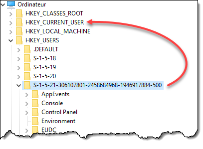


#### HKEY_CLASSES_ROOT (HKCR)

La clé racine `HKEY_CLASSES_ROOT` (en abrégé `HKCR`) contient la configuration des types de documents, d'extensions et des protocoles pris en charge par Windows. L'organisation de cette racine est assez complexe, mais essentielle à Windows puisque c'est là qu'est rassemblée toute l'information qui permet à Windows de savoir, par exemple, quelle application démarrer si on double-clique sur un fichier portant une extension, quelles sont les options disponibles dans le menu contextuel, etc.

Cette racine est en fait une combinaisaison de deux clés:
- `HKEY_LOCAL_MACHINE\SOFTWARE\Classes` (la configuration système)
- `HKU\(sid)_CLASSES` (la configuration utilisateur)

Un paramètre défini dans la configuration utilisateur a préséance sur le même paramètre défini dans la configuration système.

:::tip
La partie *Classes* du profil utilisateur n'est pas sauvegardée dans `%USERPROFILE%\NTUSER.DAT` comme le reste de sa ruche, elle est dans un fichier différent: `%LOCALAPPDATA%\Microsoft\Windows\UsrClass.dat`
:::


## Accès au registre avec PowerShell

On peut facilement lire et écrire des informations dans le registre de Windows via le fournisseur `Registry`.

### Obtenir la liste des sous-clés d'une clé

On obtient la liste des sous-clé d'une clé avec la commande `Get-ChildItem`.


Pour voir seulement la liste des clés, sans montrer aussi les valeurs qui y sont contenues, on peut ajouter le *switch* `-Name`.


### Tester si une clé existe

Pour tester si une clé existe, c'est très simple: il suffit d'utiliser `Test-Path`.


### Créer une clé

Pour créer une nouvelle clé, on peut utiliser la commande `New-Item`.

```powershell
New-Item -Path "HKCU:\SOFTWARE\MaNouvelleClé"
```

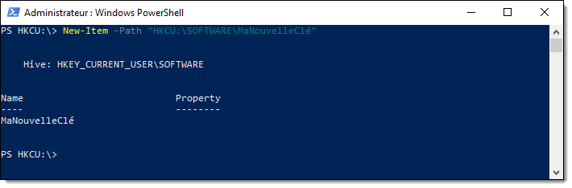

Pour que ça fonctionne, la clé parente doit exister. On peut cependant spécifier le switch `-Force` pour que l'arborescence de clé soit automatiquement créée.

```powershell
New-Item -Path "HKCU:\SOFTWARE\UneClé\UneSousClé\UneSousSousClé" -Force
```

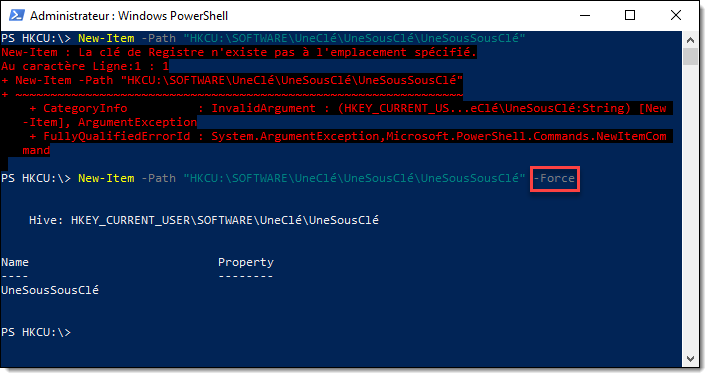

### Effacer une clé

Pour effacer une clé, il suffit d'utiliser la commande `Remove-Item`.

```powershell
Remove-Item -Path "HKCU:\SOFTWARE\MaNouvelleClé"
```

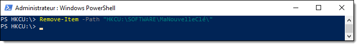

Si cette clé contient des sous-clés, on peut spécifier le switch `-Recurse` pour effacer récursivement toutes les sous-clés.

```powershell
Remove-Item -Path "HKCU:\SOFTWARE\UneClé" -Recurse
```


### Obtenir les valeurs dans une clé

Pour obtenir toutes les valeurs dans une certaine clé, on peut utiliser la commande `Get-ItemProperty`.

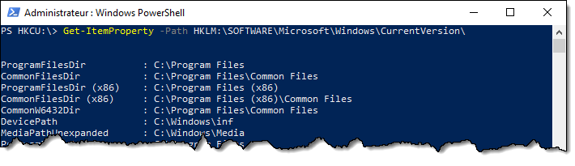

Pour obtenir une valeur spécifique, on peut utiliser la commande `Get-ItemPropertyValue` en spécifiant la clé comme chemin et le nom de la valeur.


Il existe plusieurs autres manières d'obtenir les données dans une valeur de registre. Voici quelques autres exemples:

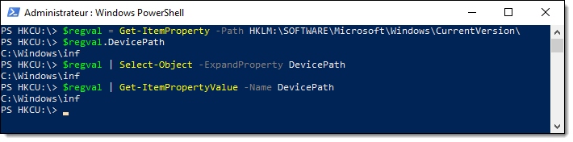

On peut aussi utiliser la méthode `.GetValue()` d'une clé, comme le montre l'exemple ci-dessous:

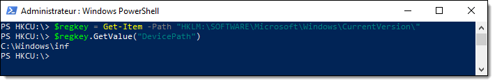


### Tester si une valeur existe

Voici une manière de tester si une valeur existe. Elle consiste à rechercher toutes les valeurs dans la clé spécifiée, puis filtrer pour ne ressortir que celle dont le nom correspond à ce qu'on cherche. 

```powershell
Get-ItemProperty -Path "HKCU:\Uneclé\" | Where-Object -Property "UnNomDeValeur"
```

Si le résultat de cette ligne ne sort rien (donc `$null`), ça signifie que la valeur n'existe pas dans cette clé. Autrement, la commande donne quelque chose, donc n'est pas `$null`.

On peut intégrer cette logique dans une condition.

```powershell
$CheminClé = "HKCU:\Chemin\vers\une\clé\"
$NomValeur = "MaValeur"

if (Get-ItemProperty -Path $CheminClé | Where-Object -Property $NomValeur) {
    # La valeur existe
}
else {
    # La valeur n'existe pas
}
```

Ou encore, à l'inverse...

```powershell
$CheminClé = "HKCU:\Chemin\vers\une\clé\"
$NomValeur = "MaValeur"

if (-not (Get-ItemProperty -Path $CheminClé | Where-Object -Property $NomValeur)) {
    # La valeur n'existe pas
}
else {
    # La valeur existe
}
```

:::tip
Si la clé n'existe pas, Get-ItemProperty retournera une erreur. Pour masquer cette erreur, on peut spécifier `-ErrorAction SilentlyContinue`

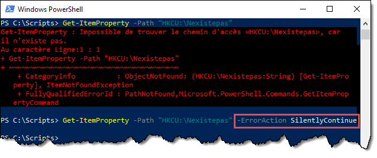
:::


### Créer une valeur

Pour créer une valeur dans le registre, on peut utiliser la commande `New-ItemProperty`.

Voici un exemple qui modifie la configuration du bloc-notes de Windows pour que la police de caractères soit "Comic Sans MS".

```powershell
$NewRegValSplat = @{
    Path = "HKCU:\SOFTWARE\Microsoft\Notepad\"
    Name = "lfFaceName"
    PropertyType = "String"
    Value = "Comic Sans MS"
}

New-ItemProperty @NewRegValSplat
```

Pour créer une valeur numérique, il suffit de faire définir le type à "Dword".

```powershell
$NewRegValSplat = @{
    Path = "HKCU:\SOFTWARE\MonScript\"
    Name = "MaValeurNumérique"
    PropertyType = "Dword"
    Value = 123
}

New-ItemProperty @NewRegValSplat
```


### Modifier une valeur existante

Pour modifier une valeur de registre existante, on peut utiliser la commande `Set-ItemProperty`. La valeur doit déjà exister pour que cette commande fonction

```powershell
$NewRegValSplat = @{
    Path = "HKCU:\SOFTWARE\Microsoft\Notepad\"
    Name = "lfFaceName"
    PropertyType = "String"
    Value = "Comic Sans MS"
}

New-ItemProperty @NewRegValSplat -Force
```

:::tip
Pour créer une valeur si elle n'existe pas ou la modifier si elle existe, dans une seule commande, il suffit d'activer le paramètre `-Force` de `New-ItemProperty`. Ceci va forcer la création de la valeur, en l'écrasant si elle existe

```powershell
$NewRegValSplat = @{
    Path = "HKCU:\SOFTWARE\MonScript\"
    Name = "MaValeurNumérique"
    PropertyType = "Dword"
    Value = 123
}

New-ItemProperty @NewRegValSplat
```
:::

### Effacer une valeur

Pour effacer une valeur de registre, on peut utiliser la commande `Remove-ItemProperty`.

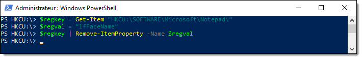


## Streams

PowerShell utilise divers "*streams*" pour passer des objets. On connaît déjà le *stream* principal; c'est lui qu'on appelle le *pipeline* de PowerShell. On le qualifie également de *stream* 1 et *stream* de sortie (*output stream*). Il y a d'autres *streams*, pour permettre la circulation d'autres types d'objets.

| # | Stream | Commande pour y écrire | Description |
| - | ------ | ---------------------- | ----------- |
| 1 | Output / Success | `Write-Output` | C'est le pipeline principal. La commande `Write-Output` est facultative; tout objet qui résulte d'une commande sans être affecté à une variable tombe dans ce *stream*. |
| 2 | Error | `Write-Error` | C'est dans ce *stream* que circulent les erreurs, qui sont affichées en rouge avec de l'information supplémentaire. |
| 3 | Warning | `Write-Warning` | On peut envoyer des messages d'avertissement dans ce *stream*. Ils seront affichés d'une autre couleur dans la console avec une mention d'avertissement. |
| 4 | Verbose | `Write-Verbose` | Ce *stream* est destiné au texte de verbose. Un script ou une commande peut écrire une sortie plus détaillée, qui est masquée par défaut. Il faut activer la verbose pour le voir, soit avec le paramètre `-Verbose` ou avec la variable `$VerbosePreference`.
| 5 | Debug | `Write-Debug` | Ce *stream* permet la circulation d'information de débogage. Comme pour la verbose, ce qui y circule est caché par défaut. |
| 6 | Information | `Write-Information` | Ce *stream* permet la circulation d'information supplémentaire pouvant aider au développement. Comme pour la verbose, ce qui y est envoyé est caché par défaut. `Write-Host`, tout en écrivant du texte dans la console, envoie aussi une copie de ce texte dans le *stream* Information. |

Les différentes commandes `Write-____` permettent d'envoyer des objets dans un stream particulier.

```powershell
"Ceci est envoyé dans le stream Output (le pipeline principal de PowerShell)."
Write-Output "Ceci est aussi envoyé dans le stream Output (le pipeline principal de PowerShell)."
Write-Error "Ceci est envoyé dans le stream Error, et sera écrit en rouge avec des infos supplémentaires."
Write-Warning "Ceci est envoyé dans le stream Warning et sera écrit en jaune avec une mention d'avertissement."
Write-Verbose "Ceci est envoyé dans le stream Verbose et ne sera pas affiché par défaut."
Write-Debug "Ceci est envoyé dans le stream Debug et ne sera pas affiché par défaut."
Write-Information "Ceci est envoyé dans le stream Information et ne sera pas affiché par défaut."
Write-Host "Ceci est écrit directement dans la console, ainsi que dans le stream Information."
```

### Stream 1: Output / Success

Le stream Output est tout simplement le pipeline PowerShell que vous connaissez déjà. C'est dans ce stream que les commandes produisent leurs objets de sortie. La commande Write-Output sert à envoyer des objets dans ce stream, mais ce n'est pas nécessaire puisque tous les objets y circulent par défaut.


### Stream 2: Error

Le stream Error est le "pipeline" sur lequel les erreurs circulent. Les objets circulant dans ce stream sont ultimement convertis en texte pour son affichage dans la console, mais ce texte est formaté en rouge avec des informations sur l'erreur. 

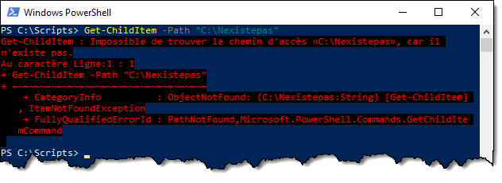

On peut produire des erreurs avec la commande `Write-Error`.

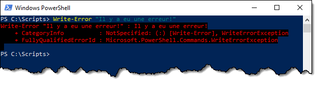

Il est possible de cacher ou ignorer les erreurs et spécifiant à une commande une action en cas d'erreur. Par exemple, `-ErrorAction SilentlyContinue` fait en sorte que la sortie de ce stream ne sera pas affichée.


On peut aussi le faire globalement en modifiant la variable `$ErrorActionPreference`. Par défaut, l'action en cas d'erreur est "Continue", mais vous pouvez la changer pour "SilentlyContinue" pour que toutes les erreurs n'apparaissent pas dans la console. Notez que cette variable ne sera modifiée que pour la session PowerShell en cours.

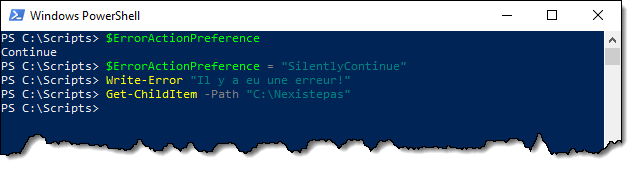


:::info
Voici les valeurs d'action supportées pour les erreurs. Ces actions sont sensiblement les mêmes pour la préférence de traitement des autres streams.

| Action | Effet |
| -- | -- |
| Stop | Arrêt immédiat du script ou de la fonction. |
| Continue | Le script ou la fonction affiche signale une erreur mais poursuit son exécution (c'est le comportement par défaut pour les erreurs). |
| SilentlyContinue | Le script continue et n'affiche aucun message d'erreur, mais l'erreur est tout de même envoyée dans le *stream*. |
| Ignore | Ignore les erreurs sans aucun signalement. (Cette valeur est inadmissible dans `$ErrorActionPreference`.) |
| Inquire | Le script affiche le message d'erreur et demande à l'utilisateur s'il souhaite continuer ou arrêter. |
:::


### Stream 3: Warning

Ce stream est utilisé pour écrire des messages d'avertissement à l'utilisateur. On pourrait le faire à l'aide de Write-Host, mais le stream Warning offre la même fonctionnalité que celui des erreurs: par le paramètre `-WarningAction` ou une changement à la variable `$WarningPreference`, qui est par défaut à "Continue", on peut modifier le comportement en cas d'avertissement. Ainsi, en spécifiant l'action "SilentlyContinue", les avertissements seront masqués.

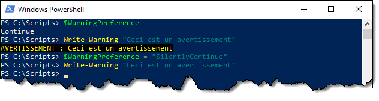


### Stream 4: Verbose

Ce stream est utilisé pour écrire des messages détaillés, si l'utilisateur le souhaite. La commande pour y envoyer des messages est `Write-Verbose`. Les messages passés dans ce stream sont masqués par défaut, ce qui laisse l'impression que la commande ne fait rien. Comme pour les autres streams, il existe une variable qui contrôle si le message est affiché ou non. Dans le cas du stream Verbose, cette variable est `$VerbosePreference` et sa valeur par défaut est "SilentlyContinue". On peut la changer à "Continue" pour que l'affichage de ce stream soit envoyé dans la console.

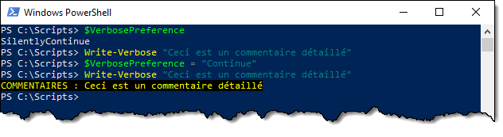

On n'utilisera pas vraiment cette technique, par contre. La raison pour laquelle on souhaiterait utiliser la commande Write-Verbose dans un script est pour afficher des messages détaillés optionnels, et permettre à l'utilisateur qui appelle le script de spécifier en paramètre s'il veut afficher ces messages. PowerShell offre un mécanisme pour ça.

Tout d'abord, on doit "transformer" le script en cmdlet. PowerShell ajoute à toutes les commandes un certain nombre de paramètres: ce sont les **paramètres communs**. Simplement en ajoutant la mention `[CmdletBinding()]` au début du script, juste avant le bloc `param()`, le script ou la fonction importera ces paramètres communs.

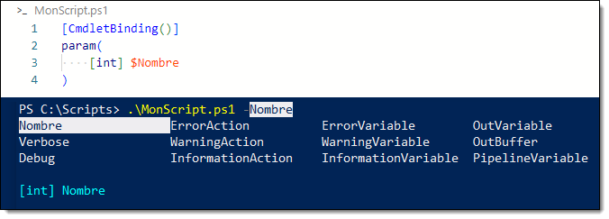

Un des paramètres commun est le switch `-Verbose`, et lorsqu'on le spécifie, a pour effet d'activer la verbose pour le script.

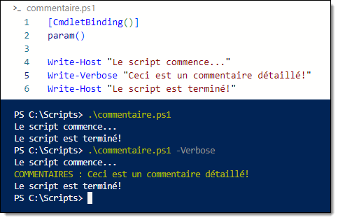


:::tip
Si votre script est muni d'une fonction de logging, vous pouvez ajouter le même message, moins le *timestamp*, dans le stream Verbose à l'aide de la commande `Write-Verbose`. Vous ferez alors d'une pierre deux coups et ajouter ces deux opérations (l'écriture à un fichier et à la verbose) dans votre fonction de log.
:::
