import Tabs from '@theme/Tabs';
import TabItem from '@theme/TabItem';

# Rencontre 10 - PSRemoting et planification de tâches

:::note Résumé de la séance

<Tabs>

<TabItem value="deroulement" label="👨‍🏫 Déroulement du cours">

- Protocoles de communication pour l'administration à distance
  - MSRPC / DCOM
  - WinRM / WS-Management
- Sessions PowerShell à distance (PSRemoting et WinRM)
  - Interactif par la console (Enter-PSSession, Exit-PSSession...)
  - Dans un script (New-PSSession, Invoke-Command...)
- Planification de tâches
  - Par l'interface graphique
  - Au moyen de commandes PowerShell
  - À distance via WinRM

</TabItem>

<TabItem value="exercices" label="💻 Exercices à compléter">

Faites la partie 2 du [TP2](../tp/tp2.md#partie-2-script-de-d%C3%A9ploiement).

</TabItem>

<TabItem value="ressources" label="📚 Ressources à consulter">

La présentation PowerPoint est sur le Teams du cours, sous le canal Général > Fichiers > Supports de cours.

</TabItem>

</Tabs>

:::


## WMI à distance

On peut lancer des requêtes WMI à distance sur une machine du réseau, en spécifiant le paramètre `-ComputerName` de la commande `Get-WmiObject`.

Pour que ce soit possible, il faut s'assurer de plusieurs choses:
- La machine distante est joignable sur le réseau
- Le service WMI (winmgmt) est actif sur la machine distante (c'est le cas par défaut)
- Nous avons des droits d'administration sur la machine distante
- Le pare-feu laisse passer le trafic WMI

Lorsque les machines sont membres du domaine et que nous sommes authentifiés avec un compte qui possède des droits d'administration sur les machines (c'est le cas du compte d'admin du domaine), il suffit de préciser le nom de la machine et les requêtes se font à travers le réseau.

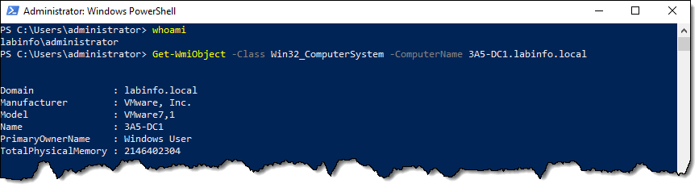


Le paramètre `-ComputerName` est de type `string[]`, donc il est possible de lui donner plusieurs ordinateurs, ou encore de lui passer un tableau de strings.

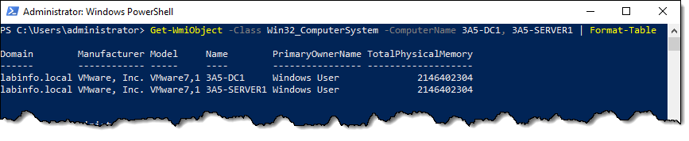

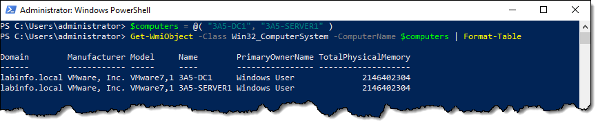

:::tip
Même si le nom du paramètre suggère qu'on doive passer un nom d'ordinateur, on peut aussi passer l'adresse IP numérique de l'ordinateur ou encore le nom DNS complet (FQDN). Dans un environnement de domaine simple, on tend souvent à n'indiquer que le nom de l'ordinateur, puisque les machines membres du domaine vont automatiquement appliquer le suffixe DNS de leur domaine. 

Concernant les résolutions de nom court: Par exemple, si on tente de résoudre le serveur *SRV01* sur une machine client membre du domaine *auto.cemti.ca*, la résolution réelle se fera sur *SRV01.auto.cemti.ca*. 
:::


### Préparation

Dans plusieurs cas, l'administration à distance de Windows est désactivée pour des raisons de sécurité. On l'active au besoin. Dans plusieurs entreprises, où la gestion des ordinateurs à distance est importante, ces configurations sont automatisées.

#### Pare-feu

WMI repose sur DCOM et RPC, deux protocoles d'administration à distance intégrés à Windows. Ceux-ci sont actifs par défaut sous Windows, mais le pare-feu bloque le trafic provenant de l'extérieur. Pour permettre de passer des requêtes WMI à une machine distante, il faut ouvrir le pare-feu des machine sur lesquelles vous voulez vous connecter.

Pour ce faire, démarrez la console avancée du pare-feu de Windows (wf.msc) et activez l'ensemble de règles du groupe "Windows Management Instrumentation".

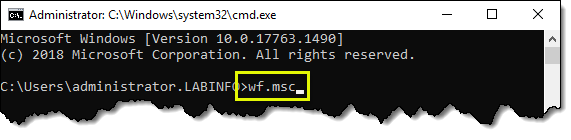

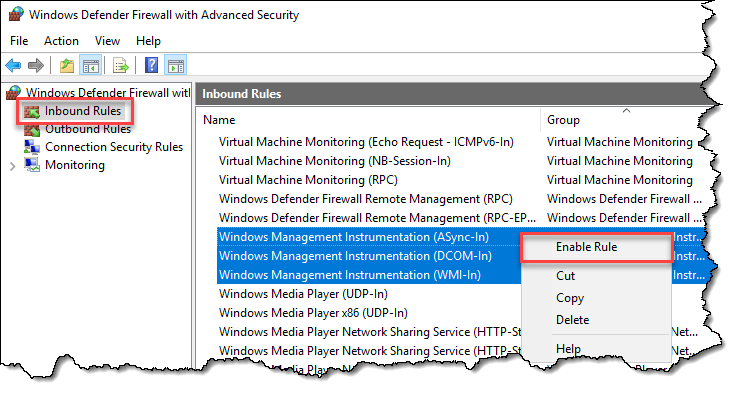

Vous pouvez maintenant tester la connexion en spécifiant les paramètres `ComputerName` et `Credential` (si nécessaire).

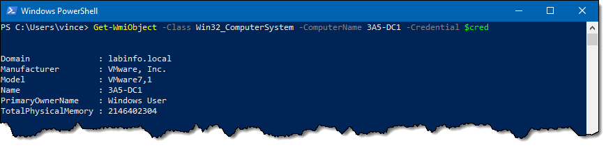


### Get-Credential

Pour administrer une machine à distance, il faut minimalement avoir les privilèges pour l'administrer.

Dans un domaine Active Directory, l'authentification est généralement intégrée. Lorsque vous ouvrez une session sur votre machine avec votre compte AD, c'est ce même compte qui sera automatiquement passé à la machine distante que vous tentez d'administrer. Cela simplifie beaucoup les choses.

Lorsqu'on veut poser une action sur un serveur distant avec un compte différent de celui dont on s'est servi pour s'authentifier à notre machine, une manière de procéder est par l'emploi de la commande `Get-Credential`.

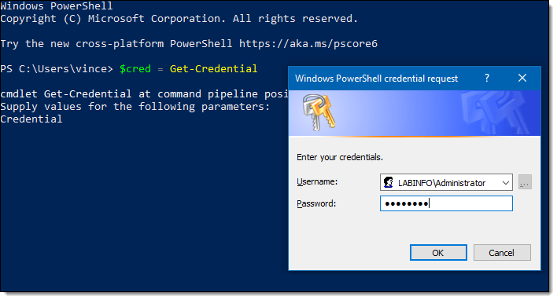

L'objet retourné est de type `PSCredential` et est le type d'objet à passer lorsqu'une commande possède un paramètre `Credential`

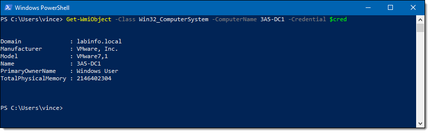


:::tip
On ne devrait jamais utiliser `Get-Credential` dans un script ou une fonction, car cela force une action de l'utilisateur même s'il possède déjà des droits suffisants. Ça l'obligerait à se réauthentifier à chaque lancement du script. On ne devrait utiliser `Get-Credential` que lorsque l'utilisateur doit utiliser un compte différent que celui avec lequel il opère sa session PowerShell.

En fait, on devrait plutôt créer un paramètre `-Credential` non-obligatoire dont la valeur par défaut est un jeton vide.

```powershell
[CmdletBinding()]
Param(
    [System.Management.Automation.PSCredential]
    $Credential = [System.Management.Automation.PSCredential]::Empty
)
```

On passe alors `$Credential` dans les paramètres `-Credential` des commandes qui sont appelées. Si le paramètre n'a pas été spécifié au lancement du script, le jeton est vide, et cela indique à la commande d'exécuter la commande au nom de l'utilisateur qui l'appelle.

`Get-Credential` devrait seulement être utilisé au moment d'appeler le script, au besoin.

```powershell
.\MonScript.ps1 -Credential (Get-Credential)
```
:::


### Objets PSCredential

Creusons un peu dans l'objet `PSCredential`.

Cet objet possède deux propriétés: `UserName` et `Password`.

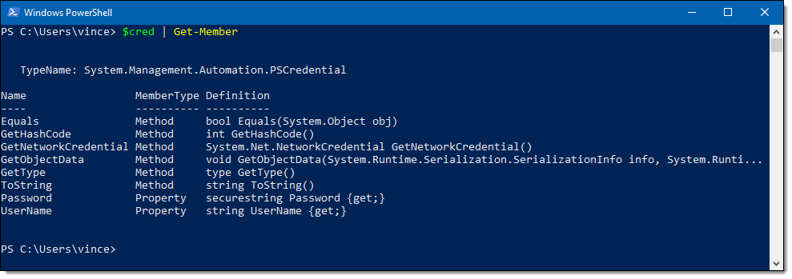

Pourtant, le mot de passe n'est pas visible. Il s'agit d'un objet `SecureString`.

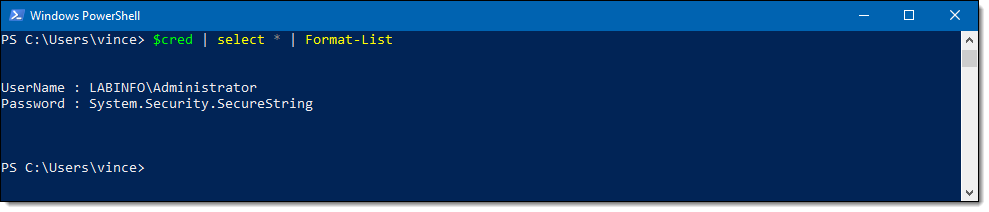

Les objets `SecureString` servent principalement à stocker des mots de passe de manière sécuritaire. On peut leur affecter une chaîne de caractères, mais on ne peut pas la lire. Le mot de passe contenu dans cet objet est chiffré.

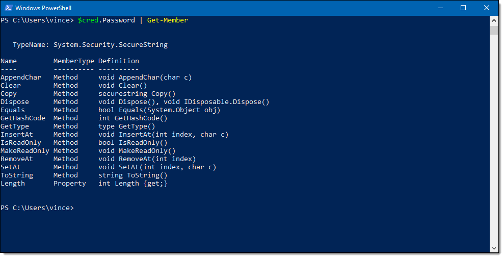


### RPC et WinRM

Le système d'exploitation Windows offre plusieurs options pour permettre aux administrateurs systèmes de les administrer à distance, à travers le réseau.

Nous avons vu précédemment comment les requêtes WMI, à l'aide de la commande `Get-WmiObject`, peuvent être passées à des hôtes distants. C'est possible au moyen du protocole RPC (Remote Procedure Call), un protocole datant des années 80. Microsoft a utilisé RPC dans ses outils de gestion dès les débuts de Windows NT, dans les années 90, et est encore aujourd'hui largement utilisé. C'est ce protocole qui permet l'administration à distance avec WMI et les consoles de gestion MMC (comme Computer Management).

RPC n'a pas été conçu pour la sécurité, qui n'était pas un grand enjeu à l'époque. Microsoft a fait évoluer le protocole, lui greffant des routines de sécurité, mais ça a donné un protocole très complexe et fragile. La nature du protocole oblige, entre autres, à ouvrir un très grand nombre de ports entrants (tous les ports de 1024-65535, éventuellement réduit à 49152-65535), ce qui élargit la surface d'exposition à des menaces extérieures. Aussi, le trafic RPC n'est généralement pas chiffré (à l'exception des credentials).

Microsoft a donc développé un nouveau protocole d'administration à distance pour Windows, avec cette fois-ci la sécurité en tête. Ce protocole, c'est WinRM. Il est basé sur HTTP/HTTPS, comme pour le Web.


### Activation de WinRM sur un serveur

Pour activer WinRM sur une machine (la machine qui va recevoir la connexion), on peut utiliser la commande suivante, dans une console powershell élevée (en tant qu'administrateur)

```powershell
Enable-PSRemoting -Force
```

Si WinRM est déjà activé, la commande vous le dira. Sinon, la commande se chargera d'activer WinRM pour vous, incluant le service et le pare-feu.

On peut également utiliser la commande winrm quickconfig pour arriver au même résultat.


:::tip
Si votre serveur n'est pas dans un domaine, on peut activer WinRM mais la procédure est différente.

Comme le profil de connexion n'est pas celle d'un domaine, Windows le considère moins sécuritaire. Si votre serveur est connecté dans un environnement que vous considérez sécuritaire (un réseau local d'entreprise par exemple), vous pouvez demander de sauter la vérification.

```powershell
Enable-PSRemoting -Force -SkipNetworkProfileCheck
```

Aussi, il faut préciser la liste des machines de confiance. Lorsqu'on est dans un domaine, toutes les machines membres du domaine sont dignes de confiance. Lorsqu'on n'est pas dans un domaine, on doit les définir.

```powershell
Set-Item WSMAN:\localhost\Client\TrustedHosts -Value "192.168.123.45" -Force
```

Si vous voulez accepter la connexion de n'importe quelle machine du réseau, vous pouvez mettre * comme valeur. Mais sachez que ce n'est pas une bonne pratique de sécurité.

Ensuite, redémarrez le service WinRM pour que les changements soient pris en compte.

```powershell
Restart-Service WinRM
```
:::

#### Le pare-feu

Normalement, la règle de pare-feu est créée automatiquement. Vous pouvez vous en assurer dans la console du pare-feu (wf.msc).

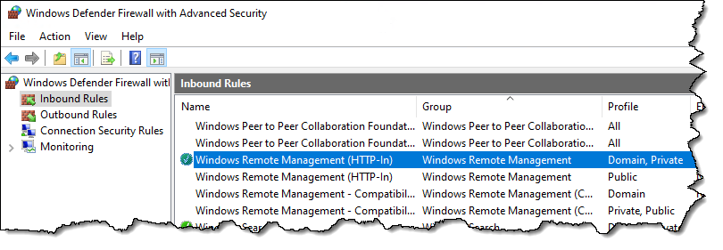


#### Chiffrement

Une bonne pratique, lorsqu'on active WinRM, est de permettre le chiffrement du trafic. Par défaut, c'est HTTP qui est utilisé et pas HTTPS. Pour permettre le chiffrement du trafic, tout comme avec HTTPS pour le Web, on a besoin d'un certificat SSL. On n'entrera pas dans ces détails dans le cadre de ce cours, mais si ça vous intéresse, consultez ce guide: https://4sysops.com/archives/powershell-remoting-over-https-with-a-self-signed-ssl-certificate/.


## Sessions PowerShell à distance

Une fois que WinRM a été activé sur le serveur, vous pouvez maintenant vous y ouvrir une session PowerShell distante. Pour ce faire, utilisez les commandes dont le nom est PSSession.

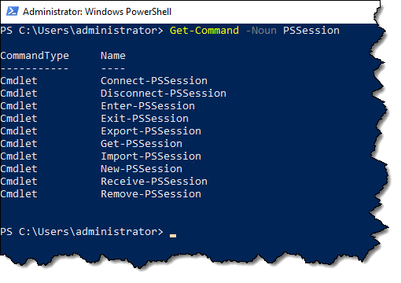

Pour accéder à la ligne de commande à distance, la commande à utiliser est `Enter-PSSession`.

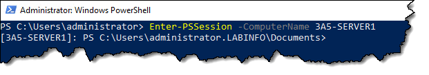

Une fois dans la session distante, on voit le nom du serveur dans l'invite. Toutes les commandes qu'on tape ici seront faites comme si nous étions physiquement sur le serveur.

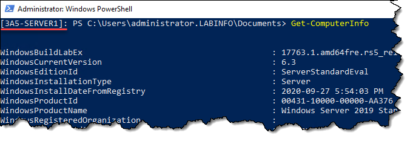

Pour quitter la session, vous pouvez utiliser la commande `Exit-PSSession`.

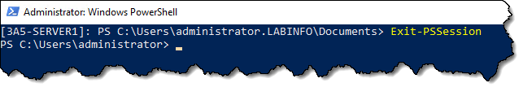


### Authentification

Dans un environnement Active Directory, on se connecte au serveur distant en utilisant par défaut l'identité de l'utilisateur présentement loggé. On peut utiliser le paramètre `-Credential` pour spécifier un utilisateur différent.

En entreprise, il n'est pas rare de recourir à cette façon de faire. Les utilisateurs (même les admins) utilisent un compte régulier, sans droits d'administration, pour travailler sur leur poste de travail. Ils ont un deuxième compte, qu'ils utilisent pour se connecter à des sessions distantes, et c'est ce compte qui possède les droits d'administration.

Dans cet exemple, l'utilisateur du système est loggé avec le compte alice, qui n'a aucun droit d'administration. Lorsqu'on tente de se connecter sur le serveur, l'accès est refusé.

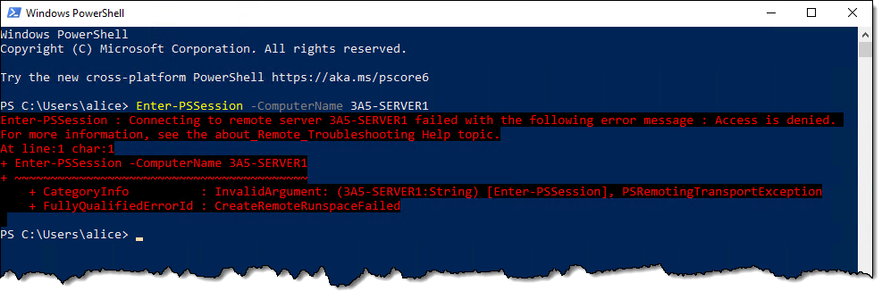

Pour se connecter en tant qu'un utilisateur qui possède des droits sur ce système, il faut spécifier les credentials. On les obtient avec `Get-Credential`.

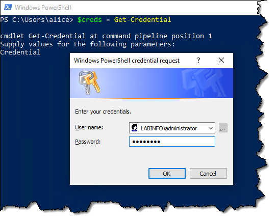


Et on passe cet objet dans le paramètre -Credential.

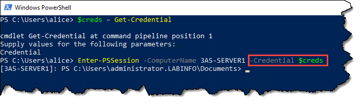


### Créer des sessions PowerShell

Les sessions interactives, c'est bien, mais on doit faire toutes nos commandes dans l'ordinateur distant. Si on a un script à exécuter, il faut d'abord le transférer sur l'ordinateur distant, ce qui n'est pas pratique.

On peut ouvrir des sessions PowerShell à distance, non pas pour accéder à la console, mais pour y lancer des commandes.

Créer la session

On créer une nouvelle session avec la commande `New-PSSession`. Celle-ci sera ouverte et portera un numéro d'identification.

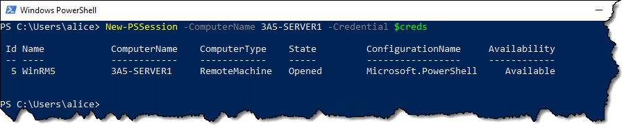

Obtenir les sessions existantes

On peut obtenir l'état des sessions en cours avec `Get-PSSession`.

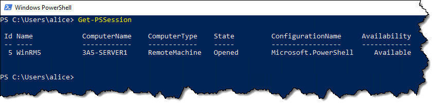

Affecter une session à une variable

Pour obtenir une session spécifique et la mettre dans une variable, on peut l'affecter avec `Get-PSSession` si la session est déjà ouverte, ou encore, l'affecter directement avec `New-PSSession`.

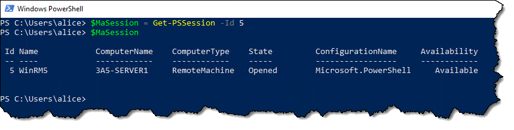

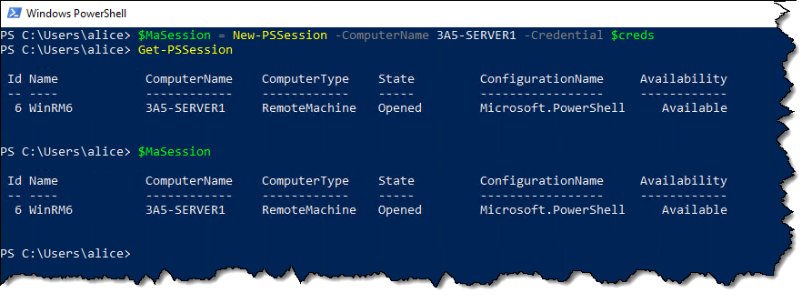


#### Terminer une session

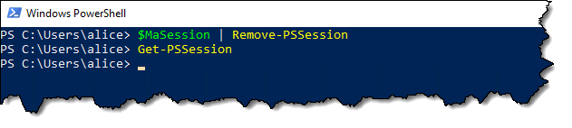


#### Terminer toutes les sessions ouvertes

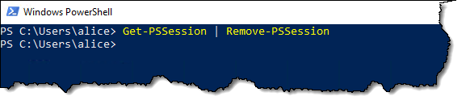


### Invoke-Command

La commande Invoke-Command exécute une commande à distance. Elle est équivalente à appeler powershell.exe sur la machine distante.

On peut l'utiliser de deux manières.

#### Exécuter un bloc de commandes

Le bloc de commandes se définit avec le paramètre `-ScriptBlock`, entre accolades. C'est pratique pour lancer une commande simple sur les machines distantes.

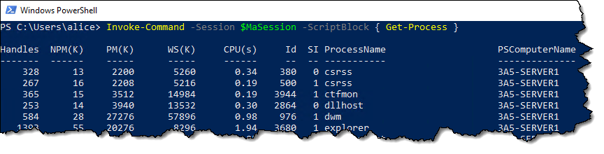


:::caution
Une session PSSession à distance correspond à une session PowerShell ouverte sur une autre machine. Par conséquent, elle est distincte de la session locale. Par exemple, une variable qu'on définit dans la session locale ne sera pas accessible sur la session distante.

```powershell
$NouveauDossier = "C:\MonDossier"
$Session = New-PSSession -ComputerName "SRV01"

Invoke-Command -Session $Session -ScriptBlock { 
    New-Item -Path $NouveauDossier -ItemType Directory  # Ne fonctionnera pas!
}
```

L'exemple précédent ne fonctionnera pas, puisque la variable `$NouveauDossier` n'a jamais été créée dans la session distante. Elle n'existe que dans la session locale.

Pour pouvoir récupérer une variable locale dans un bloc de code à envoyer à une machine distante, il faut utiliser le préfixe `$using:` avant le nom de la variable.

```powershell
$NouveauDossier = "C:\MonDossier"
$Session = New-PSSession -ComputerName "SRV01"

Invoke-Command -Session $Session -ScriptBlock { 
    New-Item -Path $using:NouveauDossier -ItemType Directory
}
```

On peut aussi effectuer un *splatting* avec un hashtable défini localement dans une commande distante avec le préfixe `@using:`, de la même manière.

```powershell
$NouveauDossierSplat = @{
    Path = "C:\MonDossier"
    ItemType = "Directory"
}
$Session = New-PSSession -ComputerName "SRV01"

Invoke-Command -Session $Session -ScriptBlock { 
    New-Item @using:NouveauDossierSplat
}
```
:::


#### Exécuter un script

Lorsqu'on a un plus grand nombre de commandes à lancer sur la machine distante, on peut appeler un script.

Dans cet exemple, on crée un script tout simple composé seulement de la commande `Get-Process`, mais ça pourrait être un script beaucoup plus complexe. Ce script sera lancé dans la session distante.

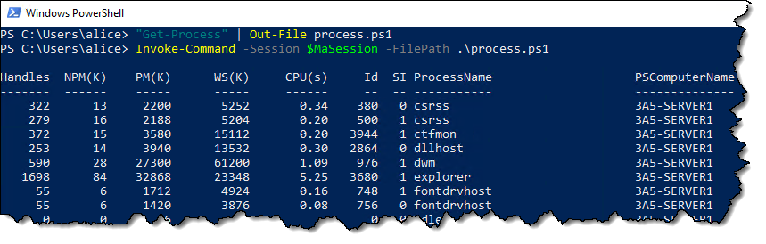


#### Spécifier les noms de machines au lieu des sessions

On peut aussi créer les sessions automatiquement, en spécifiant les noms de machines plutôt que des sessions, mais si vous avez plusieurs commandes à lancer, il sera plus pratique de réutiliser la même session pour chacune des commandes au lieu de les réinitier à chaque fois.

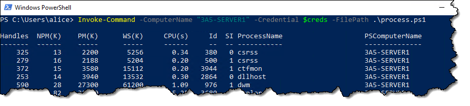


### PSRemoting et pipeline

Comme c'est une session PowerShell, ce qui sort de la commande distante, c'est un objet. Et cet objet sort sur le pipeline local du client. Autrement dit, quand la commande est lancée à distance, ce qu'elle laisse dans le pipeline revient à l'appelant, et nous pouvons manipuler cet objet à notre guise.

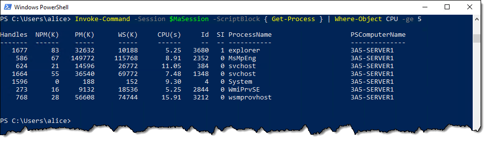

On peut aussi affecter cet objet dans une variable.


### Plusieurs sessions en même temps

On peut lancer une commande sur plusieurs sessions d'un coup. 

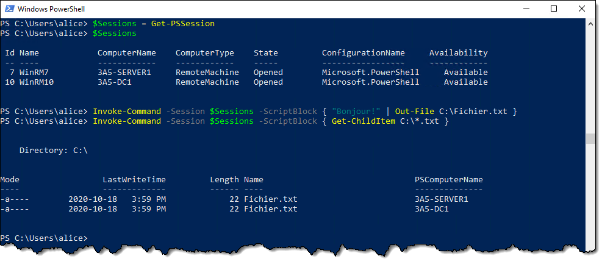


### Copie de fichiers à travers une session

Il est possible de copier un fichier à travers une session PSRemoting à l'aide de la commande `Copy-Item`.


#### De la machine locale vers la machine distante

Si on spécifie le paramètre `-ToSession`, on envoie le fichier vers la machine cible. Le paramètre -Path représente donc le chemin sur la machine locale, et le paramètre -Destination représente le chemin sur la machine distante.

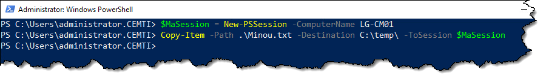


#### De la machine distante vers la machine locale

À l'inverse, si on spécifie le paramètre `-FromSession`, alors on tire le fichier de l'ordinateur distant vers l'ordinateur local. Le paramètre `-Path` représente alors le chemin sur la machine distante, et le paramètre `-Destination`, celui sur la machine locale.


## Le planificateur de tâches

Le planificateur de tâches sert, comme son nom l'indique, à planifier des opérations sous Windows afin qu'elles démarrent automatiquement selon certains critères et dans certaines conditions. Il est très utile dans de nombreux contextes, comme la planification de tâches de maintenance régulières, le démarrage d'opérations automatique au démarrage du système ou à l'ouverture d'une session utilisateur, le nettoyage automatique de fichiers temporaires, la prise de sauvegardes régulières, etc.

Avec l'interface graphique, on utilise la console MMC du planificateur de tâches, `taskschd`, ou encore la console de gestion de l'ordinateur, `compmgmt.msc`.


Les tâches planifiées sont organisées sous forme d'arborescence. La racine (nommée "bibliothèque du planificateur de tâches", ou simplement, **/**) contient un certain nombre de tâches planifiées déjà mises en place à l'installation de Windows ou d'un logiciel, mais d'autres tâches sont stockées dans des conteneurs sous la racine.

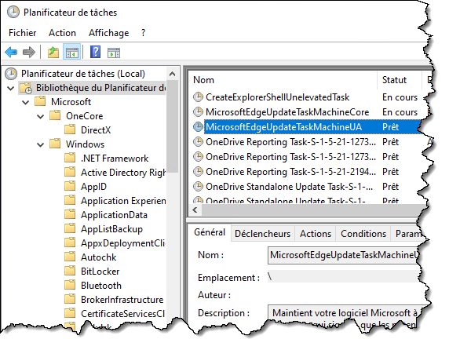

Pour créer une tâche à l'aide de l'interface graphique, il suffit d'ouvrir le menu contextuel par un clic-droit sur le conteneur où créer la tâche. Il existe deux manière de créer une tâche: simplifiée ("*créer une tâche de base...*") et avancée ("*créer une tâche...*"). Il est préférable de ne pas choisir une tâche de base, puisque certaines options sont inaccessibles.

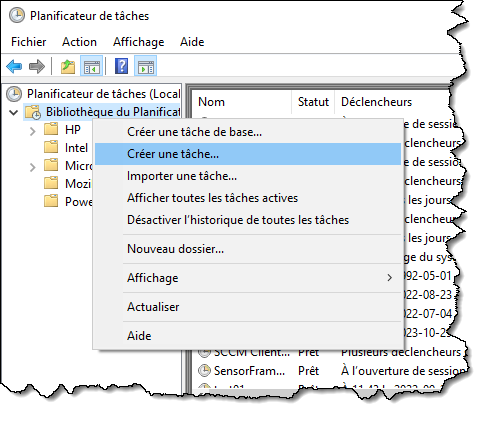


### Composition d'une tâche planifiée

Une tâche planifiée est en ensemble de plusieurs éléments d'information. Ils sont assemblés ensemble pour former une tâche planifiée incrite dans le planificateur.

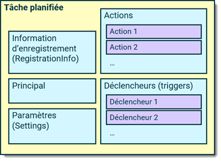

- L'information d'enregistrement (**RegistrationInfo**) contient les propriétés de la tâche qui concernent son enregistrement dans le planificateur, comme le nom de la tâche, sa description et son emplacement dans l'arborescence du planificateur.

- Les déclencheurs (**Trigger**) définissent dans quelle circonstance la tâche pourra être lancée. Par exemple, au démarrage de l'ordinateur, à l'ouverture de session, à chaque vendredi minuit, ou même lorsqu'un événement système est détecté. Il peut y en avoir plus d'un.

- Les actions (**Action**) définissent une action (comme le lancement d'une commande ou d'un script) à exécuter chaque fois que la tâche est déclenchée. Il peut y en avoir plusieurs.

- Le principal de sécurité (**Principal**) décrit avec quelle identité (un compte utilisateur ou un groupe) la tâche sera lancée. Si le principal est un compte utilisateur, alors c'est sous ce compte que la tâche sera exécutée (comme si l'utilisateur l'avait fait manuellement). Si le principal est un groupe, la tâche sera lancée au nom de l'utilisateur courant uniquement s'il est membre de ce groupe.

- Les paramètres (**Settings**) décrivent diverses options concernant la tâche. Par exemple, la tâche doit-elle être exécutée même si l'ordinateur tourne sur la batterie, ou le comportement à adopter si la tâche échoue.

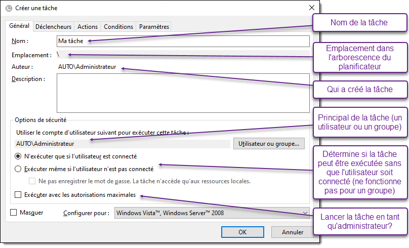

### Déclencheur (*Trigger*)

Une tâche planifiée comprend un ou plusieurs déclencheurs, c'est-à-dire des événements qui démarreront automatiquement la tâche.

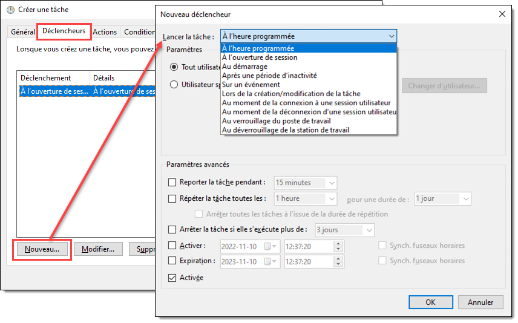

Plusieurs types de déclencheurs sont disponibles:
- À l'heure programmée
- À l'ouverture de session
- Au démarage
- Après une période d'activité 
- Sur un événement (système)
- Lors de la création/modification de la tâche
- Au moment de la connexion à une session utilisateur (par exemple, RDP)
- Au moment de la déconnexion à une session utilisateur
- Au verrouillage du poste de travail (Win+L)
- Au déverrouillage du poste de travail

### Action (*Action*)

Une tâche planifiée comprend une ou plusieurs actions qui seront lancées lorsque la tâche sera déclenchée. Le principal type d'action est le lancement d'une commande ("*démarrer un programme*").

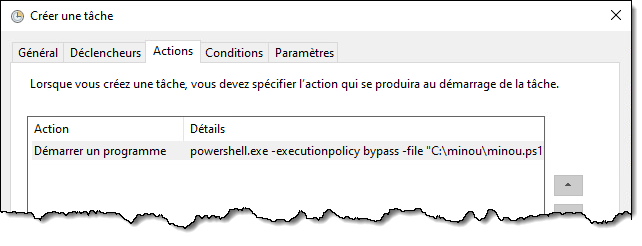

Pour lancer une commande, il faut définir trois paramètres:

| Paramètre | Description |
| -- | -- |
| Programme/script | Le nom ou chemin du fichier exécutable à appeler seulement. |
| Ajouter des arguments (facultatif) | Tous les arguments après le nom de l'exécutable. |
| Commencer dans (facultatif) | Le répertoire de travail dans lequel lancer la commande. |

Par exemple, pour qu'une tâche exécute le script PowerShell `C:\Scripts\MonScript.ps1`, il faudrait que le nom du programme soit `powershell.exe` et que les arguments soient `-File C:\Scripts\MonScript.ps1 -ExecutionPolicy Bypass`.

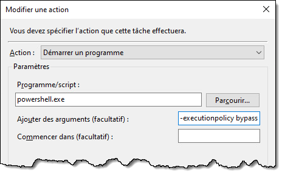

:::tip
Pour connaître la syntaxe de la commande Powershell.exe, vous pouvez lancer `Powershell.exe /?` pour accéder à la rubrique d'aide.

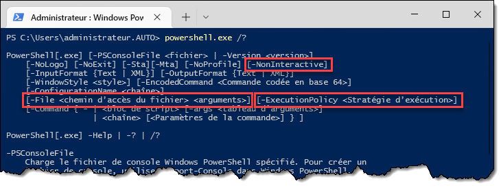
:::


### Conditions et paramètres

Les onglets Conditions et Paramètres contiennent des options supplémentaires sur la tâche.

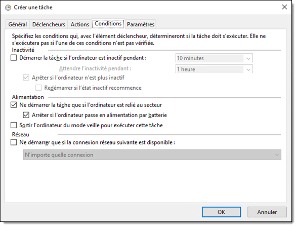

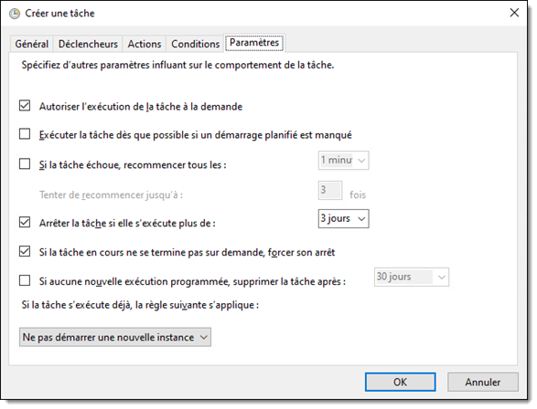


### Forcer le lancement une tâche planifiée

On peut forcer l'exécution d'une tâche planifiée directement par la console. C'est pratique pour la tester.


:::tip
Comme bien des consoles MMC, vous pouvez gérer les tâches planifiées sur une machine distante à partir de la console. Vous devez être administrateur local de la machine distante, et les pare-feux doivent laisser passer le protocole MSRPC.

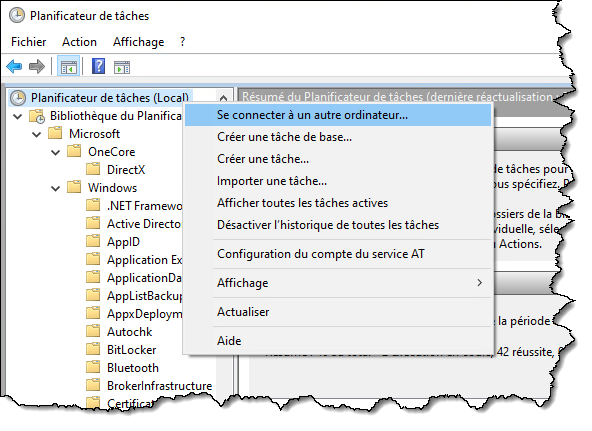
:::


## Gestion des tâches planifiées en PowerShell

PowerShell offre un ensemble de commandes pour contrôler, localement ou à distance, les tâches planifiées.

Pour ce faire, il y a plusieurs commandes à faire, puisqu'il faut créer chaque élément de la tâche planifiée individuellement, puis les mettre ensemble pour l'enregistrer dans la bibliothèque du planificateur de tâches.

### Définir le déclencheur

Il existe plusieurs déclencheurs. Il suffit ici de créer un nouveau déclencheur du type souhaité. Il faut le stocker dans une variable.

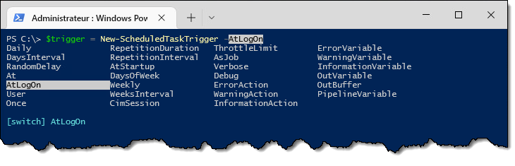


### Définir l'action

Il faut définir l'action, soit le programme a exécuter. Tout comme avec l'interface graphique, le programme à spécifier dans le paramètre -Execute n'est que l'exécutable à lancer. Si c'est un script PowerShell, alors on met "powershell.exe". Si c'est un autre programme, on met uniquement le nom du programme, sans ses arguments.

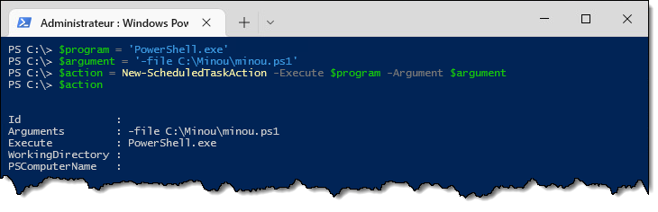


### Définir le principal

Le principal désigne l'utilisateur au nom duquel la tâche sera exécutée.

Nous avons deux options:
- Spécifier un compte utilisateur spécifique (`-UserID`)
- Spécifier un groupe (`-GroupID`)

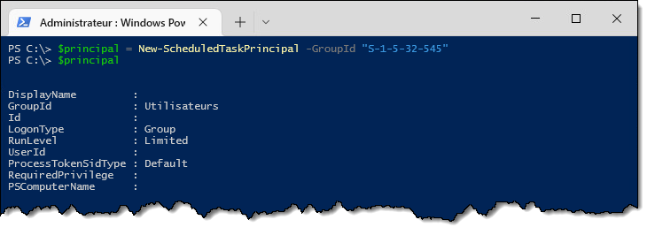

Si le principal est un utilisateur, la tâche sera faite au nom de ce compte précis.

Si le principal est un groupe, la tâche sera faite au nom de l'utilisateur courant, uniquement si celui-ci fait partie du groupe. Lorsque le principal est un groupe, il est impossible que la tâche soit lancée lorsque l'utilisateur n'est pas loggé.


### Enregistrer la tâche planifiée

Une fois tous les éléments en place, il ne reste plus qu'à enregistrer la tâche planifiée. On lui donne alors un nom, une description et un emplacement dans le planificateur, puis on lui donne une ou plusieurs actions, un ou plusieurs déclencheurs ainsi qu'un principal.

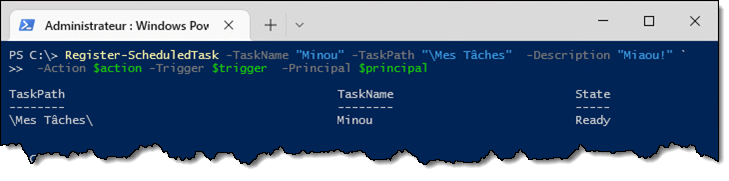


:::tip
Il est aussi possible de contrôler les tâches planifiées sur un ordinateur distant. On peut simplement passer par une session distante (PSSession) au moyen de la commande Invoke-Command.

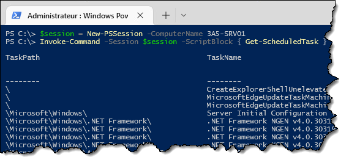
:::
