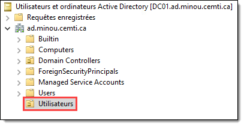
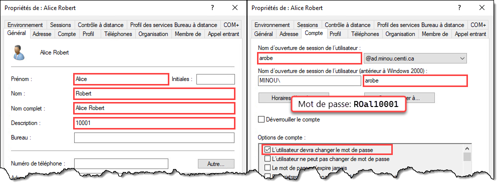
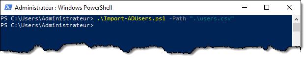
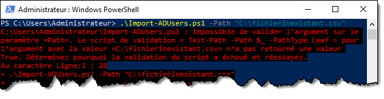
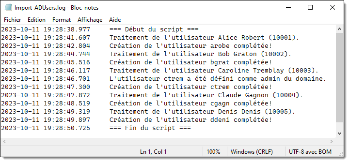

# Travail pratique 1 (A2023)

Ce TP est à faire individuellement. Il compte pour **20%** de la note du cours. La remise doit obligatoirement se faire par GitHub Classroom.

## Préparation

Pour réaliser ce laboratoire, vous devez minimalement disposer d'un domaine Active Directory. 

Voici les étapes recommandées (mais si vous avez déjà un environnement AD fonctionnel, vous pouvez l'utiliser):

1. Montez une passerelle pfSense. Vous pouvez utiliser le modèle `MODELE_pfSense (Sans DHCP)`, il est déjà configuré. Connectez **sa deuxième interface** sur l'un de vos VLAN privés et démarrez-le.
2. Montez un serveur Windows Server dans Labinfo pour agir en tant que contrôleur de domaine. Vous pouvez utiliser le modèle `MODELE_WindowsServer2022_Datacenter_x64_FR`
    - Connectez son interface à la même que la passerelle pfSense.
    - Modifiez le nom d'hôte du serveur [[Tutoriel]](https://info.cegepmontpetit.ca/b64-scriptage-sous-windows/tutoriels/ad-creation-foret#%C3%A9tape-1-changement-du-nom-dh%C3%B4te)
    - Configurez le réseau [[Tutoriel]](https://info.cegepmontpetit.ca/b64-scriptage-sous-windows/tutoriels/ad-creation-foret#%C3%A9tape-2-configuration-du-r%C3%A9seau)
    - Faites la promotion du contrôleur de domaine [[Tutoriel]](https://info.cegepmontpetit.ca/b64-scriptage-sous-windows/tutoriels/ad-creation-foret#%C3%A9tape-3-promotion-du-contr%C3%B4leur-de-domaine)
3. Installez le service DHCP sur le contrôleur de domaine [[Tutoriel]](https://info.cegepmontpetit.ca/b64-scriptage-sous-windows/tutoriels/installation-dhcp#%C3%A9tape-2-installation-du-r%C3%B4le-de-serveur-dhcp)
4. Créez une zone de recherche inverse sur le DNS [[Tutoriel]](https://info.cegepmontpetit.ca/b64-scriptage-sous-windows/tutoriels/dns-zone-recherche-inverse)
5. Joignez votre machine sur laquelle vous avez installé VS Code au domaine [[Tutoriel]](https://info.cegepmontpetit.ca/b64-scriptage-sous-windows/tutoriels/ad-jonction-domaine)
6. Installez les outils RSAT sur votre machine de développement [[Tutoriel]](https://info.cegepmontpetit.ca/b64-scriptage-sous-windows/cours/05#outils-rsat)
7. Si ce n'est pas déjà fait, installez l'outil Git sur votre machine de développement [[Lien]](https://git-scm.com/download/win)

Puis créez une unité d'organisation appelée "**Utilisateurs**" à la racine du domaine. [[Tutoriel]](https://info.cegepmontpetit.ca/b64-scriptage-sous-windows/cours/05#cr%C3%A9ation-dune-unit%C3%A9-dorganisation)




## Mandat

Vous devez développer un script PowerShell qui vise à créer des utilisateurs **du domaine** en lot. Les utilisateurs à créer sont définis dans un fichier CSV.

### Le fichier d’entrée

Le fichier CSV est construit dans le format suivant, séparé par des **points-virgules** :

```
"Prenom";"Nom";"Poste";"NoEmpl";"Admin"
"Alice";"Robert";"10001";"Non"
"Bob";"Graton";"10002";"Non"
"Caroline";"Tremblay";"10003";"Oui"
"Claude";"Gagnon";"10004";"Non"
"Denis";"Denis";"10005";"Non"
```
 
On y trouve le prénom, le nom, le poste et le numéro d’employé de chaque utilisateur à créer, ainsi qu’un champ identifiant si l’utilisateur doit être administrateur du système (oui ou non).

:::info
Notez que je n’exige pas que votre script fonctionne pour les utilisateurs dont le nom de famille est inférieur à 4 lettres. Dans mon fichier de correction, tous les utilisateurs ont un nom de famille d’au moins 4 lettres.
:::

### Comptes utilisateurs

Votre script devra créer un compte sur Active Directory pour chaque utilisateur spécifié dans ce fichier. Voici les consignes :

- Les utilisateurs doivent obligatoirement être créés dans l'unité d'organisation Utilisateurs située à la racine du domaine. Utilisez la propriété **DefaultNamingContext** de l'objet retourné par `Get-ADRootDSE` pour déterminer dynamiquement le suffixe du nom distinctif.

- Le **nom d’utilisateur** doit être la première lettre du prénom et les 4 premières du nom de famille, en **lettres minuscules**. (Dans ce travail, il n’y aura pas de noms de famille de moins de 4 caractères). Les attributs **Name**, **sAMAccountName** et **UserPrincipalName** doivent tous trois porter ce nom.

- Le **prénom** et le **nom** de l'utilisateur correspond au fichier d'entrée.

- Le **nom complet** de l’utilisateur est son prénom suivi de son nom.

- La **description** de l’utilisateur est son numéro d'employé..

- Le **mot de passe** doit être les 2 premières lettres du nom de famille en **majuscules**, les 2 premières lettres du prénom en **minuscules**, suivi du numéro d’employé.

- L'utilisateur **doit changer son mot de passe** à la prochaine ouverture de session.

- Si l’utilisateur doit être **admin**, il doit être ajouté au groupe des **administrateurs** du système, sinon il doit être dans le groupe des **utilisateurs réguliers**.

Si on devait créer les utilisateurs manuellement, voici à quoi ils ressembleraient dans l'interface graphique:




### Lancement du script

Le script doit **exiger** un paramètre `-Path` **obligatoire** dans lequel on spécifie le chemin du fichier CSV à charger. Le script doit alors créer les utilisateurs selon les paramètres indiqués dans le fichier. **Le script ne doit rien retourner sur le pipeline et ne doit pas montrer de message d'erreur.**

**Le paramètre `-Path` doit aussi pouvoir accepter une valeur à l'entrée du pipeline.**



Les comptes ainsi créés devraient être visibles dans la console Utilisateurs et ordinateurs Active Directory.


 
### Validation du paramètre

Le script doit planter si le chemin spécifié en paramètre est invalide. Pour ce faire, vous devez utiliser les **fonctionnalités de validation des paramètres** de PowerShell.


 
### Journalisation

Le script doit aussi garder une trace de toutes les actions qu’il entreprend dans le fichier **Import-LocalUsers.log** :
- Début du script
- Traitement d’un utilisateur
- Création de l’utilisateur
- Ajout au groupe d'administration si nécessaire
- Fin du script

Chaque ligne doit être horodatée (timestamp) dans le format illustré, avec une précision en millisecondes. Cette fonctionnalité doit être réalisée au moyen d’une **fonction**, et cette dernière doit avoir un maximum d’autonomie. Par ailleurs, le fichier doit être situé sous **C:\\Users\\*utilisateur*\\AppData\\Local\\Temp\\Import-ADUsers\\** (celui-ci doit être créé automatiquement s’il n’existe pas). Vous devez utiliser au maximum les variables d’environnement offertes par Windows. **La logique de création automatique de répertoire devrait se trouver dans la fonction de journalisation.**


 
## BONUS: Traitement des conflits de noms

Lors du traitement des utilisateurs, il se peut qu’il y ait plusieurs utilisateurs qui portent des noms semblables, qui auraient des noms d’utilisateurs identiques. Programmez la logique nécessaire dans votre script pour que si un nom d’utilisateur doit être identique à un existant, il doit être suivi d’un 1, puis d'un 2, puis d’un 3, et ainsi de suite, comme illustré ci-dessous.


Une implémentation de cette fonctionnalité pourrait vous valoir 10% en points bonis!


## Consignes de remise

Vous devez remettre ce travail sur GitHub. Vous êtes libres d’utiliser le client Git de votre choix (VS Code, GitKraken, GitHub Desktop, SourceTree, git cli, etc.) ou même simplement télécharger vos fichiers par l'interface Web.

## Conseils

Voici quelques conseils qui pourraient vous aider à mener à bien ce travail :
- Avant de commencer à coder, décrivez les étapes en pseudo-code pour déterminer la logique générale du script. Vous pourrez ensuite &laquo;&nbsp;traduire&nbsp;&raquo; ce pseudo-code en PowerShell, étape par étape.
- Utilisez une machine virtuelle pour tester votre script. Vous pouvez installer VS Code sur votre VM pour développer votre script.
- Lancez VS Code en tant qu’administrateur pour pouvoir tester votre script directement dans Code.
- Utilisez le paramètre `-WhatIf` pour tester votre script sans qu’une action réelle ne soit posée.
- Faites-vous un petit script de nettoyage pour effacer les utilisateurs créés en trop.
- Utilisez GitHub à votre avantage. Dès que vous avez réussi quelque chose dans votre script, faites un commit et un push dans GitHub. Vous pourrez ainsi profiter de l’historique.
- Testez des parties de votre script au lieu de lancer le script au complet à chaque fois. N’hésitez pas à tester les commandes toutes seules, définir des variables manuellement pour tester, etc.
 
## Critères d’évaluation

Le script sera évalué selon les critères suivants :

| Critère d'évaluation | Pondération |
| :-- | --: |
| Conception et fonctionnement général | 10% |
| Paramètres du script | 10% |
| Traitement du fichier d’entrée | 10% |
| Création des utilisateurs | 40% |
| Journalisation | 15% |
| Lisibilité et documentation | 10% |
| Respect des consignes | 5% |
| **Total** | **100%** |

Voici les détails de ce qui sera évalué pour chaque critère:

- **Conception et fonctionnement général [10%]**
    - Le script fonctionne du premier coup
    - Aucune erreur n’est affichée pendant l’exécution
    - Logique générale du script (pas de code inutile ou redondant)
    - Respect des bonnes pratiques de programmation
- **Paramètres du script [10%]**
    - Définition des paramètres conformes à l’énoncé
    - Paramètre obligatoire
    - Validation de l’existence du fichier en entrée
    - Traitement du paramètre par l’entrée du pipeline
- **Traitement du fichier d’entrée [10%]**
    - Lecture juste du fichier CSV en entrée
    - Utilisation des commandes et paramètres appropriés
- **Création des utilisateurs [40%]**
    - Création correcte des comptes utilisateurs locaux
    - Les attributs sont conformes à l'énoncé
    - Utilisation adéquates des commandes
    - Ajout des comptes admin au groupe des administrateurs du domaine
- **Journalisation [15%]**
    - Écriture des étapes d’exécution dans un fichier log
    - Emploi d’une fonction de journalisation
    - Autonomie de la fonction
    - Emplacement du fichier log conforme à la demande
    - Utilisation adéquate des variables d’environnement
- **Lisibilité et documentation [10%]**
    - Choix judicieux des noms de variables et de fonctions
    - Utilisation judicieuse des commentaires
    - Indentation correcte
    - Propreté du code
- **Respect des consignes [5%]**
    - Remise du script sur GitHub tel que demandé
    - Nom du script et des paramètres tel que demandé
