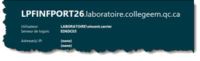

# Travail pratique 2 (A2023)

Ce TP est à faire individuellement. Il compte pour **30%** de la note du cours. La remise doit obligatoirement se faire par GitHub Classroom.

## Mandat

Vous devez implanter l’outil [BGInfo](https://learn.microsoft.com/fr-ca/sysinternals/downloads/bginfo) (faisant partie de la suite [Sysinternals](https://learn.microsoft.com/fr-ca/sysinternals/) de Microsoft) dans votre environnement de serveurs et de postes de travail Windows. Cet outil sert à modifier le fond d’écran pour y ajouter de l’information utile comme le nom de la machine, le domaine, le nom d’utilisateur, la configuration IP, etc.

L'outil BGInfo doit être lancé automatiquement **à chaque ouverture d'une session utilisateur**, afin de rafraîchir le fond d'écran avec l'information la plus récente. C'est pourquoi dans ce TP, il vous faudra réaliser deux scripts:
- Un **script de lancement** de BGInfo, qui devra être démarré automatiquement au démarrage d'une session, au moyen d'une tâche planifiée, et qui lancera l'outil BGInfo en lui chargeant le modèle approprié au type de machine et à l'utilisateur.
- Un **script de déploiement**, qui devra créer une tâche planifiée sur une ou plusieurs machines de votre réseau (à l'aide de sessions PSRemoting);


## Préparation

Voici les étapes à suivre pour vous préparer à faire ce TP:

1. Assurez-vous d'avoir correctement préparé **toutes les machines de votre domaine** pour pouvoir exécuter des scripts (`Set-ExecutionPolicy RemoteSigned`) et pour accepter des sessions distantes (`Enable-PSRemoting -Force`).

2. Assurez-vous de démarrer une session avec un compte **administrateur du domaine** sur votre machine de développement (celle sur laquelle vous avez installé VS Code). Elle doit être membre de votre domaine. Cela peut être un poste de travail Windows 10 ou le contrôleur de domaine, peu importe.

3. Cliquez sur le lien GitHub Classroom qui vous a été communiqué par votre professeur et clonez le dépôt sur votre machine de développement. Vous devriez avoir ces fichiers dans le répertoire racine de votre dépôt:

    

4. Ouvrez la racine de ce répertoire dans Visual Studio Code.


## Partie 1: Script de lancement

**Nom du script: `bginfo.ps1`**

L’outil **Bginfo64.exe** ainsi que trois fichiers BGI vous sont fournis pour ce TP via le lien GitHub. Les fichiers BGI décrivent comment l’outil doit se comporter, soit l’information à afficher, la couleur du fond d’écran, etc.


Pour appliquer un fichier BGI, vous devez le spécifier en paramètre à l’outil par ligne de commande. Voici la commande à utiliser, qui doit être lancée dans le contexte de l’utilisateur, **à chaque fois qu'un utilisateur démarre une session** :

```
"C:\chemin\vers\Bginfo64.exe" "C:\chemin\vers\fichier.bgi" /timer:0 /nolicprompt
```

:::tip
Dans l'exemple ci-dessus, la commande est montrée telle qu'elle devrait être écrite dans une **invite de commande classique** (cmd.exe). Dans un script PowerShell toutefois, l'appel de commandes externes devrait se faire à l'aide de `Start-Process`. Il est important de bien porter attention à la structure de la commande.

Dans la commande ci-dessus, le chemin menant à l'exécutable représente le programme. On le passe dans le paramètre **`FilePath`**. Les autres éléments (après le premier espace) sont des **arguments**. Il peut y en avoir plusieurs: `"C:\chemin\vers\fichier.bgi"` est un argument, `/timer:0` en est un autre et `/nolicprompt` en est un troisième. Il faut passer tous les arguments dans le paramètre **`ArgumentList`**, séparés par des virgules.

Par exemple, pour lancer la commande `"C:\Windows\System32\ping.exe" /t 127.0.0.1` à l'aide de la commande `Start-Process`, la syntaxe serait:

```powershell
Start-Process -FilePath "C:\Windows\System32\ping.exe" -ArgumentList "/t", "127.0.0.1"
```
:::

La première partie du TP consistera à développer un script qui lance la commande de l’outil BGinfo en lui fournissant un fichier BGI en fonction de deux critères :
- Si l’utilisateur courant est membre du groupe local des administrateurs (SID: `S-1-5-32-544`), directement ou par *nesting*.
- Si la machine est un client ou un serveur. (Vous devez le vérifier par une requête WMI).

\**Consultez la section Conseils plus bas pour savoir comment effectuer ces vérifications.*


### Fonctionnement du script

L'algorithme principal de votre script devrait donc être semblable à celui-ci:


En fonction des vérifications menées par le script, celui-ci devra choisir un des trois fichiers BGI à passer en argument à Bginfo.exe. Voici l'effet des trois fichiers et la condition de leur application.

| Fichier | Admin? | Type de machine | Effet | Aperçu |
| -- | -- | -- | -- | -- |
| `admin.bgi` | Oui | Peu importe | Le texte s'affiche sur **fond rouge** et est **détaillé**. |   |
| `client.bgi` | Non | Poste de travail (Windows 10) | Le texte s’affiche sur le **fond d’écran existant** et est **sommaire**. |   |
| `server.bgi` | Non | Serveur ou contrôleur de domaine (Windows Server) | Le texte s’affiche sur le **fond d’écran existant** et est **détaillé**. |  |


Ce script PowerShell devra se trouver au même endroit que `bginfo64.exe` ainsi que les fichiers BGI. Il n’a pas à admettre de paramètres. Il doit simplement vérifier si l’ordinateur est un serveur ou un client, si l’utilisateur est admin ou non, et lancer la commande avec le bon fichier BGI. Vous devez utiliser la variable `$PSScriptRoot` pour vous référer à l’emplacement de votre fichier PS1.

### Conseils

- Voici comment vérifier si un utilisateur dispose de droits d'administration ou non. Cette méthode tient compte du *nesting* de groupes.

    ```powershell
    (whoami /groups /fo csv | ConvertFrom-Csv).sid -contains "S-1-5-32-544"
    ```

- Pour différencier les serveurs des postes de travail (clients), intéressez-vous à la classe WMI [`Win32_OperatingSystem`](https://learn.microsoft.com/fr-ca/windows/win32/cimwin32prov/win32-operatingsystem)

- Utilisez la commande [`Start-Process`](https://learn.microsoft.com/fr-ca/powershell/module/microsoft.powershell.management/start-process?view=powershell-5.1) pour lancer votre commande ainsi que ses arguments.

- Utilisez la variable `$PSScriptRoot` pour récupérer le chemin où se trouve votre fichier. Par exemple, si le script doit faire référence au fichier `Bginfo64.exe` situé dans le même répertoire que lui, alors son chemin pourrait être `$PSScriptRoot\Bginfo64.exe`.
 

## Partie 2: Script de déploiement

**Nom du script: `deploy.ps1`**

L’outil BGInfo sert à afficher de l’information sur le papier peint de Windows. Une fois l’outil lancé, ce texte ne sera pas mis à jour avant que l’outil soit lancé de nouveau. Il est donc recommandé de planifier son lancement au démarrage d’une session utilisateur.

Votre mandat consiste à développer un script PowerShell pour déployer votre solution d'application de Bginfo, à distance sur une ou plusieurs machines du domaine. Ainsi, après que la solution soit déployée sur une machine, tout utilisateur qui démarre une session sur cette machine verra son fond d'écran modifié par l'outil Bginfo automatiquement.

Le script devrait s’utiliser ainsi :

```powershell
.\deploy.ps1 -Ordinateurs "Serveur1"
```

Il doit pouvoir également admettre plusieurs ordinateurs dans son paramètre `Ordinateurs`.

```powershell
.\deploy.ps1 -Ordinateurs "Serveur1","Serveur2","Serveur3"
```

### Fonctionnement du script

Votre script doit effectuer les tâches suivantes, **pour chaque ordinateur spécifié en paramètre** *(ça prend une boucle!)* :

- Établir une session PowerShell à distance à l'aide de la commande `New-PSSession`.

- Créer un répertoire `C:\Scripts\` sur l'ordinateur distant à travers la session (s'il n'existe pas déjà, bien sûr).

- Copier tous les fichiers de votre solution Bginfo dans le répertoire `C:\Scripts\Bginfo\` de l’ordinateur cible (soit le fichier `bginfo.exe`, tous les fichiers BGI, et votre script `bginfo.ps1` que vous avez développé préalablement). Utilisez la variable `$PSScriptRoot` pour référer au répertoire dans lequel le script est situé.

- Créer une tâche planifiée sur l'ordinateur distant selon ces critères:

  - **Déclencheur (*trigger*):** La tâche doit être lancée automatiquement au démarrage d'une session utilisateur
  - **Action:** Le lancement du script `bginfo.ps1` doit se faire au moyen de l'interpréteur `PowerShell.exe`
  - **Principal:** Le script doit être exécuté avec les privilèges du groupe des utilisateurs (SID: `S-1-5-32-545`)

**Vous devez obligatoirement utiliser des sessions PowerShell (`PSSession`) pour réaliser ce TP. N'utilisez pas `Enter-PSSession` dans un script!**


### Conseils

- Utilisez la commande `Copy-Item` en spécifiant la session PSRemoting pour transférer les fichiers vers la machine distante

- Stockez les fichiers dans un répertoire à la racine du script. Ainsi, vous pourrez utiliser un chemin relatif à `$PSScriptRoot` plutôt qu'un chemin absolu.


## Exigences d'évaluation

L’évaluation de votre travail prendra en compte les critères suivants:

| Critère d'évaluation | Pondération |
| -- | --: |
| Partie 1: Fonctionnement du script `bginfo.ps1` | 30% |
| Partie 2: Fonctionnement du script `deploy.ps1` | 40% |
| Logique et conception | 15% |
| Style et lisibilité | 10% |
| Respect des consignes de remise | 5% |
| **Total** | **100%** |


Voici les détails de ce qui sera évalué pour chaque critère:

- **Partie 1: Fonctionnement du script `bginfo.ps1`** (30%)
  - Toutes les fonctionnalités demandées doivent être implémentées et fonctionnelles
  - Aucun objet ne doit sortir sur le pipeline
  - Utilisation adéquate de WMI
  - Il ne doit pas y avoir de message d'erreur visible lors de l'exécution du script
- **Partie 2: Fonctionnement du script `deploy.ps1`** (40%)
  - Toutes les fonctionnalités demandées doivent être implémentées et fonctionnelles
  - Définition adéquate du paramètre
  - Prise en charge de plusieurs machines à la fois
  - Gestion de la session PSRemoting et utilisation de cette session pour toutes les opérations sur la machine distante
  - Création du répertoire distant si nécessaire
  - Copie de fichiers à travers la session
  - Création de la tâche planifiée
  - Aucun objet ne doit sortir sur le pipeline
- **Logique et conception** (15%)
  - Votre code doit être logique et éviter des tournures redondantes ou inutiles
  - Éviter les chemins absolus et *hard-codés* (particulièrement ceux vers un profil utilisateur)
  - Le nom des commandes, des paramètres ainsi que la structure des objets doivent être conformes aux spécifications de l’énoncé
- **Style et lisibilité** (10%)
  - Les noms des variables et des fonctions doit être représentatif
  - Les commentaires doivent être pertinents
  - Le code doit être correctement indenté
- **Respect des consignes de remise** (5%)
  - La remise a été faite sur GitHub tel que demandé
  - Toutes les consignes sont respectées
