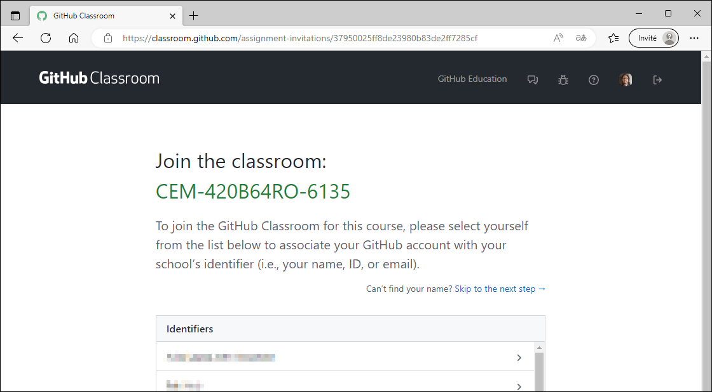
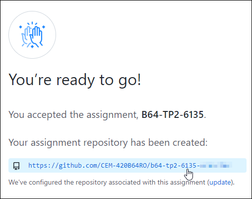
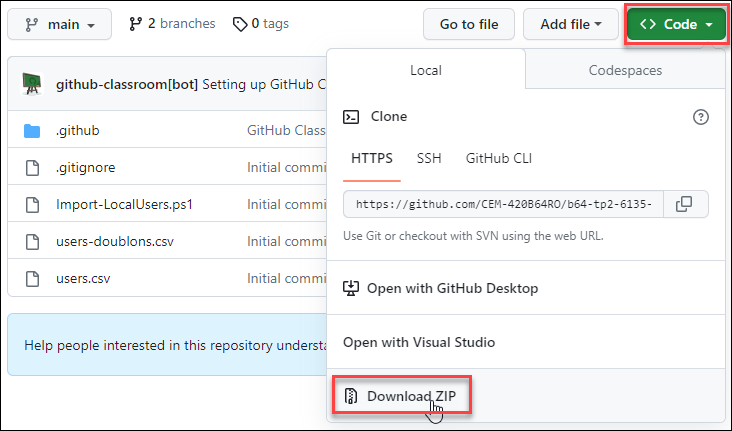
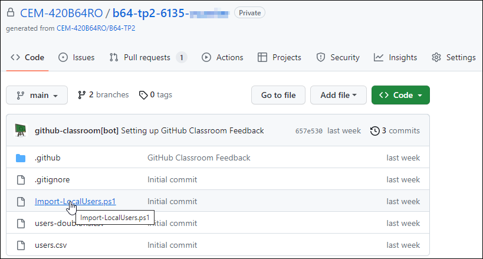
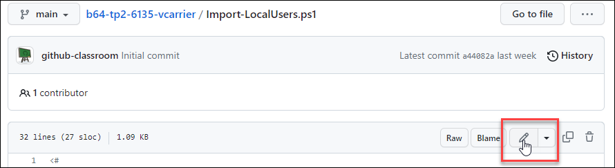
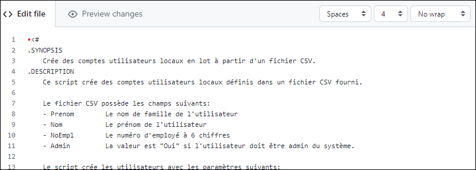
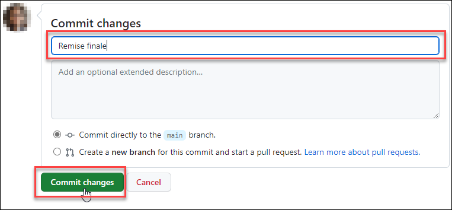

# Remise de code sur GitHub Classroom (méthode simplifiée)

La remise des TP doit se faire sur GitHub Classroom. GitHub est un système de gestion de code source très utilisé en entreprise. Il existe plusieurs manières d'utiliser GitHub; voici la manière la plus simple pour vous.

## Acceptation du TP

Tout d'abord, si ce n'est pas déjà fait, acceptez le devoir en suivant le lien que votre professeur vous a transmis et sélectionnez votre nom. Cette étape n'est à faire qu'une fois.

Cette opération a pour effet de générer un dépôt (repository) à votre nom. Prenez ce lien en note. Si le lien n'apparaît pas, attendez quelques secondes puis rafraîchissez la page (F5).

## Téléchargement des fichiers de base

Dans le dépôt, il y a plusieurs fichiers. Vous pouvez les télécharger en cliquant sur le bouton Code. Vous pouvez choisir le format Zip puis l'extraire dans un répertoire. Vous aurez le fichier PS1 initial (qui n'a que l'entête et des commentaires) ainsi que les fichiers CSV à utiliser dans votre script. 

## Remise du TP

Lorsque vous êtes prêts à effectuer la remise, vous pouvez simplement ouvrir le fichier PS1.

Dans ce fichier, cliquez sur le crayon pour passer en mode édition.

Puis modifiez votre nom dans le bloc de commentaires, et collez le code de votre script.

Pour sauvegarder le fichier, juste en-dessous du panneau d'édition, donnez un nom à votre changement (par exemple, "Remise finale") puis cliquez sur le bouton Commit changes.

