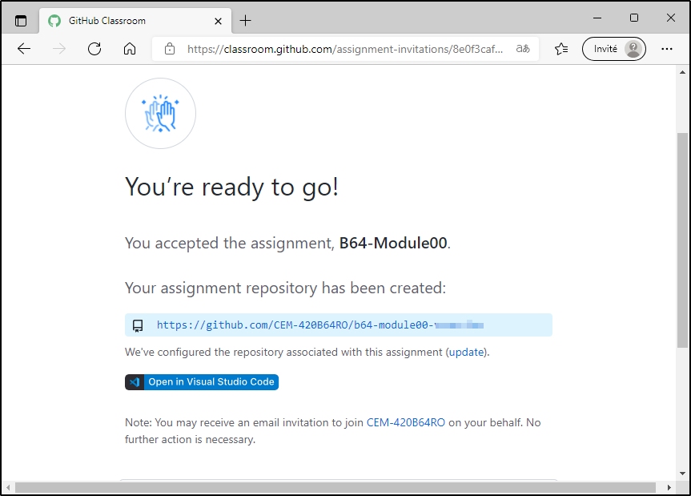

# Remise de code sur GitHub Classroom (avec le client GitKraken)

Dans ce cours, les remises se font au moyen de GitHub Classroom.

## Étape 1: Créer un compte GitHub

Naviguez vers https://github.com/login et créez un compte GitHub.

Suivez les étapes pour obtenir votre pack d'étudiant, ce qui vous donne accès à plusieurs outils gratuits, dont GitKraken.

## Étape 2: Obtenir l'énoncé du travail

Lorsqu'un nouveau travail vous sera soumis, votre prof vous communiquera un lien vers GitHub Classroom. Entrez ce lien dans votre browser préféré (sauf Internet Explorer). Authentifiez-vous à l'aide de votre compte GitHub, ou créez-en un si vous n'en avez pas.

Sélectionnez votre nom dans la liste. Vous n'aurez qu'à faire cette étape une seule fois, ensuite votre nom sera associé à votre compte GitHub.

Acceptez le travail.

Attendez quelques secondes, puis appuyez sur la touche F5 pour rafraîchir la page. Vous devriez voir un lien HTTPS vers le dépôt qui vous a été créé.

## Étape 3: Cloner le dépôt

Démarrez le client GitKraken et sélectionnez GitHub. Authentifiez-vous avec votre compte GitHub au besoin.

Sélectionnez Clone, puis GitHub.com. Sélectionnez le dépôt qui vous a été créé précédemment. Vous pouvez aussi, alternativement, sélectionner Clone with URL et coller l'URL qui vous a été donné sur GitHub Classroom.

Ouvrez le dépôt dans GitKraken, puis sélectionnez Open in File Manager.

Cliquez-droit sur le répertoire du dépôt, et ouvrez-le dans Visual Studio Code (ou dans n'importe quel éditeur).

Utilisez Visual Studio Code pour modifier vos fichiers. 

## Étape 4: Procéder à une remise

Lorsque vous êtes prêts à effectuer une remise, sauvegardez tous vos fichiers, puis retournez dans GitKraken. Donnez un nom à votre remise, puis sélectionnez les changements à inclure dans votre remise ("Stage all changes") pour inclure tous les changements. Puis, effectuez l'enregistrement (commit). Finalement, cliquez sur Push pour téléverser tous les changements sur GitHub.

Vous pouvez confirmer sur GitHub que votre travail a bel et bien été remis et contient vos changements.

:::tip
Vous pouvez aussi effectuer une remise de la même manière pour "backuper" votre travail sur GitHub, ou pour le récupérer sur un autre ordinateur. Vous pouvez faire autant de commits/push que vous le voulez. Pour récupérer les changements les plus récents (par exemple, vous vous déplacez entre le CÉGEP et chez vous ou vice-versa), il vous suffit de cliquer sur Pull, et ainsi obtenir la version la plus récente qui se trouve sur GitHub.
:::

## Étape 4: Consulter la rétroaction

Après la remise, votre professeur pourrait vous envoyer de la rétroaction. Pour la consulter, ouvrez le dépôt sur GitHub et naviguez vers la section Pull requests et ouvrez l'élément Feedback #1. Sélectionnez votre commit, et vous devriez voir les commentaires du professeur. Vous pouvez également répondre aux commentaires pour demander des éclaircissements, si vous en ressentez le besoin.

Si vous ouvrez votre travail dans Visual Studio Code, vous pouvez également voir la rétroaction directement dans l'éditeur.

