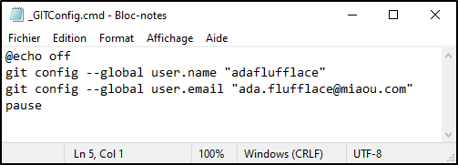
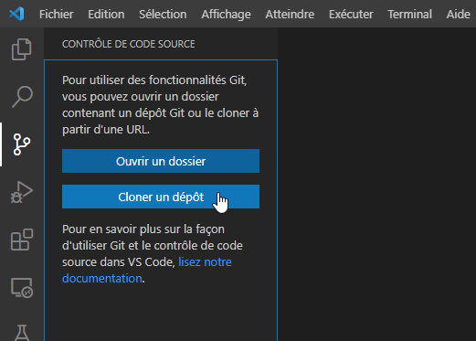
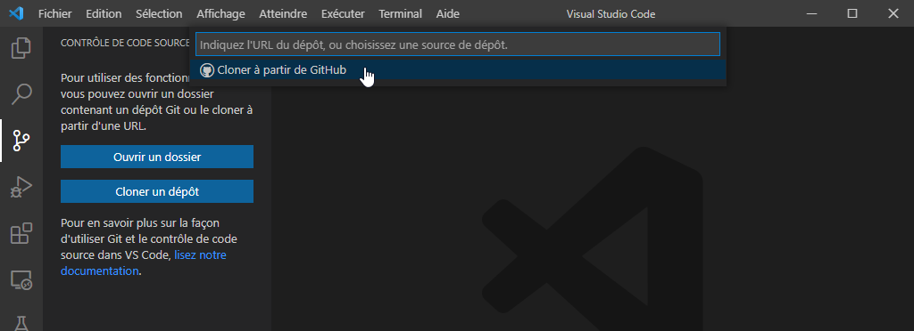
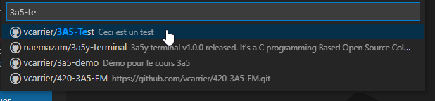
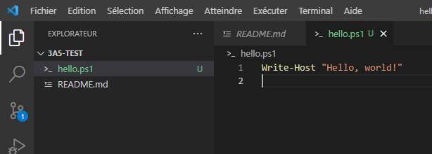
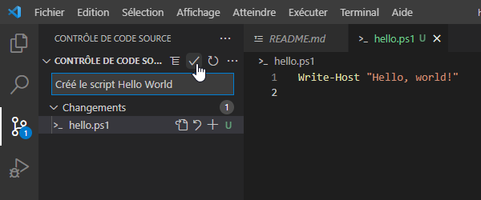
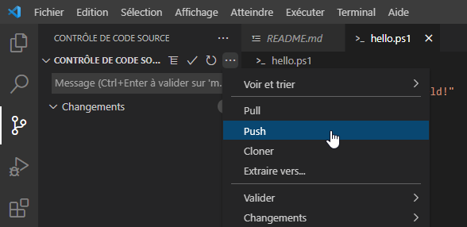

# Intégration de Git et Visual Studio Code

On peut utiliser un dépôt Git directement dans l'interface de Visual Studio Code. Voici comment.

## Installer Git

Pour pouvoir utiliser les fonctionnalités de gestion de code source offertes par VS Code, vous devez d'abord installer Git. Il est déjà installé sur les ordinateurs du CÉGEP, mais vous devez le faire sur votre ordinateur personnel.

Naviguez vers https://git-scm.com/ et téléchargez la version stable la plus récente. Vous pouvez choisir les options par défaut.


## Configuration initiale de Git

Il vous faudra ensuite configurer Git pour qu'il utilise votre nom et adresse courriel lors des commit. Il suffit d'entrer ces deux lignes de commande:

```
git config --global user.name "username"
git config --global user.email "prefix@domain.com"
```

Ces commandes ne doivent être lancées qu'une seule fois. Mais sur les machines du CÉGEP, ça doit être fait à chaque session. Je vous conseille donc de créer un petit fichier BATCH et le sauvegarder à la racine de votre lecteur personnel (Z:). Il vous sera facile de le lancer.




## Cloner un dépôt dans Visual Studio Code

Dans ce cours, vous utiliserez principalement Visual Studio Code pour développer vos scripts. Cet environnement de développement permet une intégration de Git.

Tout d'abord, il vous faut un dépôt local, c'est-à-dire un dossier sur votre ordinateur qui contient les sources. Si le repository existe dans GitHub, vous pouvez le cloner.

Ouvrez le panneau **contrôle de source** et cliquez sur **Cloner un dépôt**.



Il y a plusieurs manières de cloner un dépôt: soit vous fournissez l'URL du dépôt (celui qui a été créé pour vous lorsque vous avez accepté le travail sur GitHub Classroom), soit vous connectez Visual Studio Code à votre compte GitHub. Il faut toujours sélectionner un emplacement local sur votre ordinateur.



VS Code copie le contenu du dépôt sur votre ordinateur et dans l'onglet Explorateur, vous voyez le contenu de ce dossier. 


## Travailler dans votre dépôt

Créez ou modifiez les fichiers clonés à partir de votre dépôt.  

Lorsque vous modifiez un fichier, celui-ci est surligné, cela signifie qu'il y a eu un changement depuis la dernière synchronisation. Les nouveaux fichiers sont surlignés en vert, les fichiers existants qui ont changé sont en jaune, et ceux qui ont été effacés sont en rouge. Chaque changement que vous apportez s'enregistre sur votre copie locale, sur le disque dur.



Lorsque vous travaillez sur un projet, vous apportez sans doute beaucoup de modifications aux fichiers. Lorsque vous avez terminé quelque chose (par exemple, l'ajout d'une fonctionnalité), il est utile de faire un commit. Ça vous permet de revenir en arrière, un peu comme un snapshot. 

Pour faire un commit, retournez dans l'onglet Contrôle de source et cliquez sur le crochet. Vous devez entrer une description pour votre commit, pour savoir ce qui a changé.



Le processus de commit reste dans votre répertoire local. Pour en envoyer une copie sur GitHub, il suffit de sélectionner Push dans le menu "…". Cela aura pour effet de pousser les changements du dernier commit sur Internet.



Vous pouvez confirmer sur GitHub que le changement a été poussé. En prime, GitHub vous montre, pour chaque fichier, le nom du commit qui a mené à sa dernière modification.


