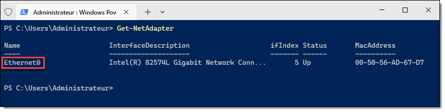

# Création d'une forêt Active Directory

Une des premières étapes à suivre lorsqu'on construit un environnement de laboratoire Windows consiste à créer un domaine Active Directory au sein d'une nouvelle forêt. Il suffit alors de procéder à la promotion d'un serveur à titre de premier contrôleur de domaine de sa forêt. On a souvent le réflexe d'utiliser l'interface graphique, mais voici comment faire à l'aide de Windows PowerShell.

Dans ce tutoriel, vous apprendrez comment créer une nouvelle forêt Active Directory Domain Services en utilisant Windows PowerShell.


## Étape 1: Changement du nom d'hôte

À l'installation du système d'exploitation, il est d'usage de modifier le nom d'hôte de la machine. Le nom d'hôte de Windows à son installation est généré aléatoirement et il est préférable que les machines de notre environnement aient un nom représentatif de leur rôle. Il est un bon réflexe de le faire au tout début du processus de montage, car il est plus compliqué changer le nom d'un système après sa promotion. Je vous recommande de le faire aussitôt le système d'exploitation installé.

```powershell
Rename-Computer -NewName "DC01" -Restart
```


:::tip
Vous pouvez omettre le paramètre `-Restart` si vous voulez éviter que le serveur ne redémarre automatiquement.
:::


## Étape 2: Configuration du réseau

Lors de l'installation de Windows, le client DHCP est activé par défaut tant pour l'assignation d'une adresse IP que pour ses résolveurs DNS. Il est généralement une bonne pratique de désactiver le client DHCP sur les serveurs et de plutôt opter pour une assignation statique.

On a l'habitude de voir les configurations IP et DNS comme une seule et même catégorie de paramètres, puisqu'ils sont configurables au même endroit dans l'interface graphique, mais avec PowerShell, on les configure avec deux commandes distinctes.


### Identification de l'interface

Tout d'abord, il nous faut connaître le nom de l'interface à configurer. Par défaut, Windows attribue les noms "Ethernet0", "Ethernet1", et ainsi de suite, selon l'ordre de leur découverte par l'énumération *Plug-and-Play*. Si le serveur possède plus d'une interface ethernet, identifiez d'abord celle qui assurera la connectivité au réseau de production.

```powershell
Get-NetAdapter
```



### Assignation de l'adresse IP

Ensuite, vous pourrez procéder à la configuration IP de cette interface. Dans cet exemple, j'ai isolé les paramètres propres à l'adressage IP dans un *hashtable* afin de la passer par *splatting*. Assurez-vous que l'adresse IP, le masque de sous-réseau ainsi que la passerelle par défaut correspondent à votre environnement.

```powershell
$IPAddressSplat = @{
    IPAddress      = "192.168.21.10"
    PrefixLength   = 24    # Équivalent à 255.255.255.0 (/24)
    DefaultGateway = "192.168.21.1"
    AddressFamily  = "IPv4"
}

New-NetIPAddress @IPAddressSplat -InterfaceAlias "Ethernet0" 
```

### Assignation du résolveur DNS

Configurez finalement le résolveur DNS. Puisque ce serveur deviendra ultimement un serveur DNS à la fin du processus de promotion, on va temporairement lui affecter des résolveurs DNS publics. Ceci sera modifié automatiquement lors de la promotion du serveur.

```powershell
Set-DnsClientServerAddress -ServerAddresses "8.8.8.8", "8.8.4.4" -InterfaceAlias "Ethernet0"
```

:::info
Lorsque le serveur est promu en tant que contrôleur de domaine, le résolveur DNS configuré dans l'interface réseau est automatiquement modifié pour 127.0.0.1, l'adresse *loopback*, faisant ainsi référence à l'hôte local. Autrement dit, l'interface réseau devient un client du service DNS hébergé sur la même machine. Tous les résolveurs DNS configurés auparavant sur l'interface seront automatiquement inscrits comme redirecteurs DNS dans la configuration du serveur.


:::


## Étape 3: Promotion du contrôleur de domaine

### Installation du rôle ADDS

Avant de pouvoir promouvoir le serveur comme contrôleur de domaine, on doit d'abord installer le rôle *Active Directory Domain Services*. Plutôt que de le faire par l'interface graphique, on peut le faire au moyen de cette commande PowerShell.

```powershell
Install-WindowsFeature -Name AD-Domain-Services -IncludeManagementTools
```

Cette commande procède également à l'installation de tous les rôles et fonctionnalités connexes, incluant le module PowerShell pour Active Directory. Vous pourrez ensuite utiliser ces commandes en les important dans votre session PowerShell.

```powershell
Import-Module -Name ActiveDirectory
```

### Promotion du contrôleur de domaine

Une fois le rôle installé, on peut procéder à la promotion. La commande `Install-ADDSForest` permet la création de la forêt par la promotion de son premier contrôleur de domaine. Il faut fournir plusieurs arguments à la commande, l'exemple suivant les identifie dans un *hashtable* pour ensuite les passer par *splatting*.

- Les paramètres `-DomainName` et `-DomainNetbiosName` désignent respectivement le nom de domaine pleinement qualifié (FQDN) du domaine et le nom NETBIOS, parfois appelé "pré-Windows 2000".

- Les paramètres `-ForestMode` et `-DomainMode` désignent le niveau fonctionnel de forêt et de domaine respectivement. La valeur "WinThreshold" signifie le niveau fonctionnel le plus élevé pris en charge par le système d'exploitation.

- Les paramètres `-DatabasePath`, `-LogPath` et `-SysvolPath` contrôlent l'emplacement où seront enregistrés la base de données (NTDS.DIT), les journaux transactionnels ainsi que le répertoire SYSVOL qui sera répliqué à travers tous les contrôleurs de domaine.

- Le paramètres `-InstallDNS` est un paramètre de type *switch* qui détermine si le service DNS doit être installé sur ce serveur. On peut aussi activer la délégation DNS avec le paramètre `-CreateDnsDelegation`. Habituellement, dans un environnement de laboratoire, on souhaite installer le service DNS mais ne pas lui configurer une délégation.

- Le paramètre `-SafeModeAdministratorPassword` permet de spécifier un mot de passe pour la récupération d'urgence. Il doit être fourni pour activer le mode de restauration des services d'annuaire (DSRM), un sorte de mode sans échec pour contrôleurs de domaine destiné à réparer ou restaurer la base de données Active Directory. Bien qu'il ne soit que peu utilisé, il peut s'avérer nécessaire en cas de problème, et il est important de choisir un mot de passe fort et de le garder en lieu sûr (et surtout pas en texte clair). Il admet une chaîne sécurisée (securestring) alors on doit procéder à sa conversion. Concernant le choix du mot de passe dans l'exemple suivant, on se permet bien sûr des largesses, puisqu'il s'agit d'un environnement de laboratoire.

Le système redémarrera automatiquement une fois l'opération complétée. Pour ne pas qu'il redémarre automatiquement, on peut activer le switch `-NoRebootOnCompletion`.


```powershell
$ADDSForestSplat = @{
    DomainName = "ad.mondomaine.com"
    DomainNetbiosName = "MONDOMAINE"
    ForestMode = "WinThreshold"
    DomainMode = "WinThreshold"
    DatabasePath = "C:\Windows\NTDS"
    LogPath = "C:\Windows\NTDS"
    SysvolPath = "C:\Windows\SYSVOL"
    InstallDns = $true
    CreateDnsDelegation = $false
    SafeModeAdministratorPassword = ConvertTo-SecureString -String "Passw0rd" -AsPlainText -Force
}

Install-ADDSForest @ADDSForestSplat -Force
```

:::info
La commande `Install-ADDSForest` sert à créer le domaine racine de sa forêt, et par conséquent, la forêt elle-même. Si on avait voulu créer un nouveau domaine dans une forêt existante (par exemple, un domaine enfant), il aurait fallu utiliser la commande `Install-ADDSDomain`. Et si on avait voulu installer un contrôleur de domaine au sein d'un domaine existant, alors la commande à utiliser aurait été `Install-ADDSDomainController`.
:::
