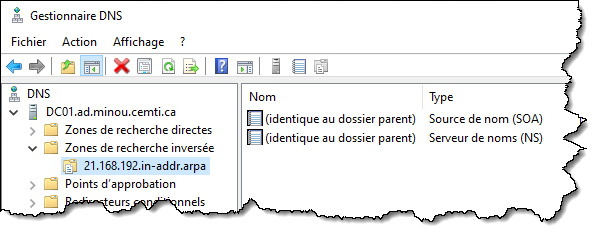
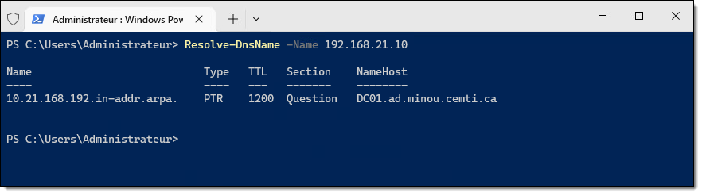
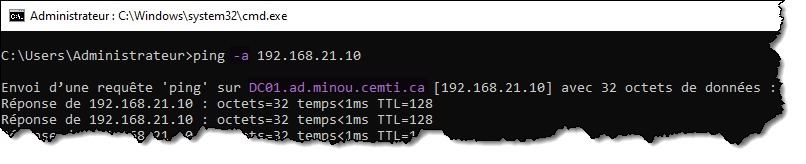

import Tabs from '@theme/Tabs';
import TabItem from '@theme/TabItem';

# Création d'une zone de recherche inverse

Les services de domaine Active Directory ont une forte dépendance à DNS. C'est par ce protocole que les hôtes membres du domaine arrivent, entre autres, à joindre un contrôleur de domaine. Tout domaine Active Directory doit être autoritaire d'une zone de recherche directe afin d'y publier les différentes entrées A et SRV nécessaires à son bon fonctionnement. Généralement, on configure un serveur DNS sur chaque contrôleur de domaine afin qu'il puisse héberger une copie de cette zone, qui sera synchronisée entre tous les serveurs DNS par le biais du mécanisme de réplication inhérent à Active Directory.

Une zone de recherche directe permet notamment de résoudre un nom d'hôte faisant partie de cette zone pour en connaître l'adresse IP numérique. Mais en plus de la zone de recherche directe, on peut, optionnellement, configurer une zone de recherche inverse. Cette dernière permet l'opération inverse, c'est-à-dire obtenir le nom de domaine à partir d'une adresse IP numérique. La résolution inverse est particulièrement intéressante dans un environnement d'entreprise.

Dans ce tutoriel, vous apprendrez comment ajouter une zone de recherche inverse dans un serveur DNS.


## Création de la zone de recherche inverse

Alors qu'une zone de recherche directe est nommée en fonction de son espace de nommage DNS, une zone de recherche inverse est nommée en fonction de son adresse réseau numérique.

L'ajout d'une zone de recherche inverse ne tient souvent qu'à une seule commande. Il suffit de lui procurer son adresse réseau numérique (avec son masque en notation CIDR) ainsi que la portée de réplication, qui peut être le domaine, la forêt, ou autres.

```powershell
Add-DnsServerPrimaryZone -NetworkID "192.168.21.0/24" -ReplicationScope "Forest"
```


## Enregistrement des clients

Une fois la zone créée, elle est vide (hormis les enregistrements NS et SOA). Chaque association entre une adresse IP numérique et un nom d'hôte devra faire l'objet d'un enregistrement PTR, soit en quelque sorte l'inverse d'un enregistrement A. 



On peut créer ces enregistrements de manière statique avec la commande `Add-DnsServerResourceRecordPtr`, mais généralement, dans un environnement d'entreprise, les hôtes membres du domaine mettent à jour automatiquement leur enregistrement PTR tout comme leur enregistrement A. Un serveur DHCP peut également mettre à jour les enregistrements des l'hôtes auxquels il assigne des baux, si celui-ci est configuré pour le faire.

La plupart du temps, les hôtes vont éventuellement mettre à jour leur enregistrement PTR. Ce processus est automatique, mais se fait lors de l'assignation d'une adresse IP. Dans les minutes qui suivent la création de la zone de recherche inverse, il se peut que tous les hôtes du réseau n'aient pas eu le temps de créer leur enregistrement PTR. On peut forcer l'enregistrement.


<Tabs>
<TabItem value="PowerShell" label="PowerShell">

```powershell
Register-DnsClient
```
</TabItem>
<TabItem value="Cmd" label="Cmd">

```
ipconfig /registerdns
```
</TabItem>
</Tabs>


## Vérification

On peut effectuer une résolution inverse de la même manière qu'une résolution directe, mais en fournissant une adresse IP numérique au lieu du nom de domaine, à l'aide des commandes `Resolve-DnsName` en PowerShell, ou `nslookup` à l'invite de commande classique.



:::tip
Lorsqu'on teste une adresse IP numérique avec la commande Ping, on peut lui demander de tenter une résolution inverse en activant le switch `-a`.


:::


